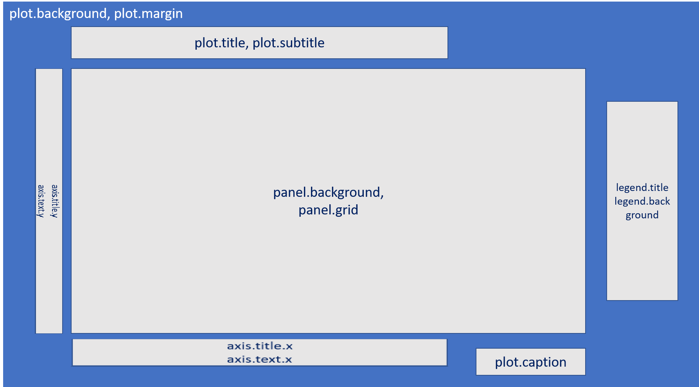

# Data Visualization & Interactive Plotting 

```{r setup, include=FALSE}
# clear-up the environment
rm(list = ls())

# chunk options
knitr::opts_chunk$set(
  message = FALSE,
  warning = FALSE,
  fig.align = "center",
  comment = "#>"
)

# scientific notation
options(scipen = 9999)
```

```{r echo=FALSE, warning=FALSE, message=FALSE}
library(tidyverse)
library(leaflet)
library(scales)
library(plotly)
library(lubridate)
library(glue)
library(forcats)
library(RCurl)
library(rmarkdown)
```

```{r, echo=FALSE}
vids <- read.csv("data/02-DVIP/USvideos.csv")
vids <- vids %>% 
  mutate(category_id = as.character(category_id),
         category_id = case_when(category_id == "1" ~ "Film and Animation",
                                 category_id == "2" ~ "Autos and Vehicles",
                                 category_id == "10" ~ "Music", 
                                 category_id == "15" ~ "Pets and Animals", 
                                 category_id == "17" ~ "Sports",
                                 category_id == "19" ~ "Travel and Events", 
                                 category_id == "20" ~ "Gaming",
                                 category_id == "22" ~ "People and Blogs",
                                 category_id == "23" ~ "Comedy",
                                 category_id == "24" ~ "Entertainment",
                                 category_id == "25" ~ "News and Politics",
                                 category_id == "26" ~ "Howto and Style",
                                 category_id == "27" ~ "Education",
                                 category_id == "28" ~ "Science and Technology",
                                 category_id == "29" ~ "Nonprofit and Activism",
                                 category_id == "43" ~ "Shows"),
         category_id = as.factor(category_id),
         trending_date = ydm(trending_date),
         publish_time = ymd_hms(publish_time, tz = "America/New_York"))

laporan <- read.csv("data/02-DVIP/data-bugdet.csv")
```

## Data Visualization

### Base Plot

#### **Bagaimana cara mengatur interval nilai sumbu x untuk visualisasi histogram?**

#### **mba atur scale y di boxplot gmn?**

### Geom

#### **Bagaimana cara menambahkan separator (,) untuk memisahkan angka ribuan pada label `geom_text()`/`geom_label()` yang terletak pada setiap batang (bar) di bar plot?**

Untuk menambahkan separator (,) dengan tujuan  memisahkan angka ribuan pada label `geom_text()`/`geom_label()` yang terletak pada setiap batang di bar plot, bisa menggunakan fungsi `comma()` dari package `scales`.
```{r}
vids1 <- vids %>% 
  filter(category_id %in% c("Education", "Science and Technology")) %>% 
  group_by(channel_title, category_id) %>% 
  summarise(total.likes = sum(likes)) %>% 
  ungroup() %>% 
  arrange(desc(total.likes)) %>% 
  head(5)
```

```{r}
ggplot(vids1, aes(x = total.likes,y = reorder(channel_title, total.likes))) +
  geom_col(aes(fill = total.likes), show.legend = F) +
  labs(title = "Top 5 Channel based on Total Likes",
       subtitle = "Category: Education & Science and Technology",
       x = "Channel",
       y = NULL,
       caption = "Source: Algoritma") +
  geom_label(aes(label = comma(total.likes)), hjust = 1.05) +
  scale_fill_gradient(low = "red", high = "black") +
  theme_minimal()
```

#### **Bagaimana cara untuk mengurutkan batang (bar) saat menggunakan `geom_bar()`?**

```{r, echo=FALSE}
vids.u <- vids[match(x = unique(vids$title),table = vids$title),]
```

Untuk mengurutkan batang ketika menggunakan `geom_bar` kita dapat menggunakan function `fct_infreq()` dari package `forcats`, kemudian untuk mengatur bar dari paling besar hingga paling kecil kita dapat menggunakan bantuan function `fct_rev()`.
```{r}
ggplot(data = vids.u, mapping = aes(y = fct_rev(fct_infreq(category_id))))+
  geom_bar() +
  labs( x = "Category",
        y = "Total Video")
```

#### **Bagaimana cara mengubah urutan kategori pada legend?**

```{r}
ggplot(data = iris, aes(x = Species,y = Sepal.Length))+
  geom_boxplot(aes(color = Species))+
  scale_color_manual(values = c("red","blue","green"))
```

Secara default katgori pada legend akan diurutkan berdasarkan urutan level/kategori:

```{r}
levels(iris$Species)
```

Untuk mengurutkan kategori pada legend, kita dapat mengubah urutan level pada kolom kategori tersebut:

```{r}
#order level
iris <- iris %>% 
  mutate(Species = factor(Species, levels = c("versicolor",
                                              "virginica",
                                              "setosa")))
#membuat visualisasi 
ggplot(data = iris, aes(x = Species,y = Sepal.Length))+
  geom_boxplot(aes(color = Species))+
  scale_color_manual(values = c("red","blue","green"))

```

#### **Bagaimana cara membuat lebih dari satu line pada satu grafik dengan menggunakan `geom_line`?**

```{r, echo=FALSE}
set.seed(100)
datline <-data.frame(
    market_A = 100 + c(0, cumsum(runif(49, -20, 20))),
    market_B = 150 + c(0, cumsum(runif(49, -10, 10))),
    date = seq(as.Date("2002-01-01"), by="1 month", length.out=100)
  )
head(datline)
```

Untuk membuat grafik line dari dua variabel sekaligus, kita perlu melakukan manipulasi dari kedua variabel tersebut menjadi satu variabel dengan bantuan function `pivot_longer()` dari package `tidyr`. Data yang akan diperoleh sebagai berikut:
```{r}
data_viz <- datline %>% 
            pivot_longer(cols = c(market_A,market_B),
            names_to = "market")
head(data_viz)
```

Setelah data dimanimpulasi, selanjutnya kita dapat melakukan visualisasi seperti biasa. Karena kita ingin membedakan grafik line berdasarkan kategori, kita bisa menggunakan parameter `group` untuk membedakan grafik line berdasarkan category.
```{r}
ggplot(data = data_viz, aes(x = date,y = value, group = market)) +
  geom_line()
```

#### **Bagaimana cara untuk menampilkan nilai (value) pada stacked bar?**

Berikut ini merupakan data yang akan digunakan untuk visualisasi:
```{r, echo = FALSE}
set.seed(100)
year <- c(rep(c("2020-01", "2020-02", "2020-03", "2020-04"), each = 4))
category <- c(rep(c("A", "B", "C", "D"), times = 4))
freq <- round(runif(16,min = 200,max = 300))
dat_cat <- data.frame(year, category, freq)
dat_cat
```

Untuk menampilkan value pada stack bar, kita dapat menambahkan function `position_stack()` pada `geom_text` dan juga sertakan label yang akan ditampilkan pada plot:

```{r}
ggplot(dat_cat, aes(x = year,y = freq)) +
  geom_col(position = "stack",
           aes(fill = category))+
  geom_text(aes(label = freq), 
            position = position_stack(vjust = 0.5))
```

#### **Bagaimana cara membuat secondary axis pada `ggplot2`?**

```{r, echo=FALSE}
weather <- ReadAxfBOM::ReadAxfBOM("http://www.bom.gov.au/fwo/IDV60901/IDV60901.94866.axf") %>% 
           select(Timestamp, air_temp)
head(weather)
```

Penggunaan secondary axis pada `ggplot2` diatur melalui function `scale_y_continuous()`, dengan menggunakan parameter `sec.axis`. Kita dapat menyesuaikan formula pada secondary axis tersebut pada parameter `trans`.
```{r }
ggplot(data = weather, aes(x = Timestamp,y = air_temp))+
  geom_line()+
  scale_y_continuous(sec.axis = sec_axis(trans = ~.*5,
                                         name = "Relative Humidity [%]"))
```

#### **Bagaimana cara membuat multi row axis label pada ggplot?**

```{r, echo = FALSE}
set.seed(100)
dat_quarter <- data.frame( year = rep(2016:2020, each = 4),
                           quarter = rep(c("Q1","Q2","Q3","Q4"),5),
                           profit = 200:219+rnorm(20,sd = 35))
head(dat_quarter)
```

Untuk membuat multi axis pada ggplot, kita dapat menggunakan function `annotate()`. Pada function `annotate()` kita dapat menambahkah geom pada plot, namun tidak seperti geom lainnya yang memetakan data frame, melainkan untuk menyisipkan elemen vector seperti label text.
```{r}
ggplot(data = dat_quarter, aes(x = interaction(year, quarter, lex.order = T),
                               y = profit, group = 1))+
  geom_line(colour = "blue")+
  annotate(geom = "text",
           x = seq_len(nrow(dat_quarter)),
           y = 126,
           label = dat_quarter$quarter, size = 4)+
  annotate(geom = "text",
           x = 2.5 + 4 *(0:4),
           y = 115,
           label = unique(dat_quarter$year),
           size = 6)+
  coord_cartesian(ylim = c(130,300),
                  expand = FALSE, 
                  clip = "off")+
  labs(title = "Total Quarterly Net Profits",
       y = NULL)+
    theme_minimal() +
  theme(plot.margin = unit(c(1, 1, 4, 1), "lines"),
        axis.title.x = element_blank(),
        axis.text.x = element_blank(),
        panel.grid.major.x = element_blank(),
        panel.grid.minor.x = element_blank())
```

#### **Bagaimana cara untuk membuat scatterplot dengan histogram marginal?**

```{r}
set.seed(100)
df <- data.frame(Var1 = rnorm(1000, 50, 10),
                 Var2 = rnorm(1000, 50,10))
head(df)
```

Untuk membuat histogram marginal, kita dapat menggunakan function `ggMarginal()` dari package `ggExtra`. Kita dapat mengatur type grafik sesuai kebutuhan, type yang tersedia yaitu density, histogram, boxplot, violin, dan densigram.
```{r}
p <- ggplot(data = df, aes(x = Var1,y = Var2))+
  geom_point()+
  theme_minimal()
ggExtra::ggMarginal(p, type = "histogram")
```

#### **Bagaimana cara membuat spatial map menggunakan `ggplot2`?**

Untuk membuat spatial map dengan `ggplot2` kita bisa menggunakan `geom_sf()` sebagai berikut:

Data yang digunakan merupakan data default dari salah satu package R, yaitu `rnaturalearth`. Untuk menarik data tersebut dapat mengunakan fungsi `ne_countries()`. 
```{r}
library(ggplot2)
library(sf)
library(rnaturalearth)

world_data <- ne_countries(scale = "medium", returnclass = "sf")
class(world_data)
```

Spatial map yang akan dibuat menggambarkan total poplasi penduduk untuk setiap negara.
```{r}
new.world_data <- world_data[(!is.na(world_data$pop_est)), ] 

ggplot(data = new.world_data) +
  geom_sf(color = "black", aes(fill = pop_est)) +
  labs(title = paste("World Map:", length(unique(new.world_data$name)), "countries"),
       x = "Longitude",
       y = "Latitude",
       fill = "Estimate Total Population") +
  scale_fill_gradient(low = "grey", high = "red") +
  theme_minimal()
```

Membuat spatial map di atas menjadi interaktif (interactive spatial map)
```{r}
# membuat kolom baru yang berisi teks yang akan ditampilkan saat dilakukan hovering
new.world_data <- new.world_data %>% 
  mutate(text = glue("Country: {name}
                      Total Population: {pop_est}")) 

# melakukan assignment spatial map ke dalam objek baru
interactive_map <- ggplot(data = new.world_data) +
  geom_sf(color = "black", aes(fill = pop_est, text = text)) +
  labs(title = paste("World Map:", length(unique(new.world_data$name)), "countries"),
       x = "Longitude",
       y = "Latitude",
       fill = "Estimate Total Population") +
  scale_fill_gradient(low = "grey", high = "red") +
  theme_minimal()

ggplotly(interactive_map, tooltip = "text")
```

### Scale

#### **Bagaimana cara memberi big mark pada axis plot?**

```{r, echo=FALSE}
vids3 <- vids %>% 
  select(channel_title, category_id, views, likes) %>% 
  filter(category_id %in% c("Education", "Science and Technology"))
```

untuk memberikan big mark pada axis dapat dibantu dengan package `scales`
```{r}
ggplot(vids3, aes(views, likes)) +
  geom_point(aes(color = category_id))  +
  scale_y_continuous(labels = comma)+
  scale_x_continuous(labels = comma)
```

#### **Apakah pengaturan label baik pada sumbu x ataupun y dapat dilakukan secara terpisah? misal kita ingin memeberikan label ribuan (1 ribu, 2 ribu, dst). Namun, pada angka 0 tidak ingin diikuti oleh "ribuan".**

Tidak bisa dilakukan secara terpisah, karena parameter `labels` pada fungsi `scale_y_continous` akan menambahkan satuan pada semua nilai label. Alternatif lain yang dapat dilakukan adalah membuat judul (title) pada sumbu x ataupun y dengan disertai oleh satuan. Misal, "Dislikes (Ribu)", kemudian membuat skalanya menjadi lebih kecil (50000 menjadi 50 saja).

#### **Bagaimana mengatasi axis yang memiliki satuan besar seperti berikut ini?**

```{r, echo = FALSE}
data_agg <- laporan %>% 
  filter(year(periode) == 2018, jenis == "Realisasi") %>% 
  arrange(daerah, desc(periode)) %>% 
  group_by(daerah) %>% 
  slice(1) %>% 
  ungroup() %>% 
  select(daerah, belanja_daerah) %>% 
  arrange(desc(belanja_daerah)) %>% 
  head(10)
```

```{r}
ggplot(data_agg, aes(x = belanja_daerah, y = reorder(daerah, belanja_daerah))) +
  geom_col(aes(fill = belanja_daerah)) +
  scale_fill_continuous(low = "orange", high = "red") +
  guides(fill = FALSE) +
  labs(
    title = "10 Daerah dengan Realisasi Belanja Daerah tertinggi 2018",
    x = NULL,
    y = NULL
  ) +
  theme_minimal()
```

Ketika kita melakukan visualisasi, adanya satuan axis yang cukup banyak tersebut dapat menyulitkan audience dalam memahami informasi pada grafik tersebut. Kita dapat mengatur scale axis pada plot tersebut dengan bantuan package `scales`. Berikut ini kita akan membuat object yang berisikan function label untuk merapihkan axis text pada plot:

```{r}
label_rupiah <- label_dollar(scale = 1e-9, prefix = "Rp ", suffix = " M")
```

Selanjutnya, aplikasikan label tersebut pada function `scale_y_continuous()`

```{r}
ggplot(data_agg, aes(x = belanja_daerah, y = reorder(daerah, belanja_daerah))) +
  geom_col(aes(fill = belanja_daerah)) +
  scale_x_continuous(labels = label_rupiah)+
  scale_fill_continuous(low = "orange", high = "red") +
  guides(fill = FALSE) +
  labs(
    title = "10 Daerah dengan Realisasi Belanja Daerah tertinggi 2018",
    x = NULL,
    y = NULL
  ) +
  theme_minimal()
```

Setelah diaplikasikan label pada axis text terlihat lebih mudah dipahami informasi yang disampaikan pada grafik tersebut.

#### **Bagaimana cara untuk mewarnai dan memberi label pada bar tertentu pada plot?**

Misalkan, pada data top 10 trending channel akan dibentuk bar plot dan kita akan membedakan warna pada top 3 channel tersebut. Untuk pewarnaan dari top 3 channel kita memerlukan `geom_col()` tambahan yang berisi 3 data awal yang akan ditampilkan, begitupun pada `geom_label()` pada parameter data kita define observasi mana saja yang ingin diberikan label.
```{r, echo = FALSE}
vids.top <- vids %>% 
  dplyr::distinct(title, .keep_all = T) %>% 
  group_by(channel_title) %>% 
  summarise(total = n()) %>% 
  arrange(desc(total)) %>% 
  head(10)

vids.top
```

```{r}
ggplot(data = vids.top,mapping = aes(x = total,
                                     y = reorder(channel_title,total)))+
  geom_col(fill = "skyblue")+
  geom_col(data = vids.top[1:3,], fill = "navy")+
  geom_label(data = vids.top[1:3,],
             mapping = aes(label = total))+
  labs(title = "Top 10 Trending Channel in US",
       subtitle = "Based on Video Count",
       x = "",
       y = "Video Count")+
  theme_minimal()
```

### Theme

#### **Secara umum elemen-elemen apa saja yang dapat diatur/disesuaikan pada fungsi `theme()`?**

Berikut adalah gambaran elemen-elemen apa saja yang dapat diatur/disesuaikan dengan fungsi `theme()`



  - `plot.background`: digunakan untuk menyesuaikan/mengatur warna background plot/kanvas. Digunakan dengan menambahkan parameter `element_rect` untuk menyesuaikan warna background yang diinginkan (`colour`).

  - `plot.margin`: digunakan untuk memberi jarak antara kanvas utuh dengan kotak tempat plot berada. Digunakan dengan menambahkan parameter `unit`.

  - `plot.title`: digunakan untuk menyesuaikan/mengatur elemen yang berkaitan dengan judul plot. Digunakan dengan menambahkan parameter `element_text()` untuk mengatur spesifikasi tulisan yang diinginkan mulai dari ukuran (`size`), rata kiri-kanan/alignment (`hjust`), cetak tebal/miring (`face`), dll.

  - `plot.subtitle`: digunakan untuk menyesuaikan/mengatur elemen yang berkaitan dengan sub-judul plot. Digunakan dengan menambahkan parameter `element_text()` untuk mengatur spesifikasi tulisan yang diinginkan mulai dari ukuran (`size`), rata kiri-kanan/alignment (`hjust`), cetak tebal/miring (`face`), dll.

  - `axis.title.x`: digunakan untuk menyesuaikan/mengatur elemen yang berkaitan dengan judul pada bagian sumbu x (horizontal). Digunakan dengan menambahkan parameter `element_text()` untuk mengatur spesifikasi tulisan yang diinginkan mulai dari ukuran (`size`), rata kiri-kanan/alignment (`hjust`), cetak tebal/miring (`face`), dll.

  - `axis.text.x`: digunakan untuk menyesuaikan/mengatur elemen yang berkaitan dengan tulisan pada bagian sumbu x (horizontal). Digunakan dengan menambahkan parameter `element_text()` untuk mengatur spesifikasi tulisan yang diinginkan mulai dari ukuran (`size`), rata kiri-kanan/alignment (`hjust`), cetak tebal/miring (`face`), dll.

  - `axis.title.y`: kegunaanya sama persis seperti parameter `axis.title.x`, perbedaanya adalah digunakan pada sumbu y (vertikal).

  - `axis.text.y`: kegunaanya sama persis seperti parameter `axis.text.x`, perbedaanya adalah digunakan pada sumbu y (vertikal).

  - `panel.background`: digunakan untuk mengubah warna panel background, dengan menambahkan parameter `element_rect` untuk menyesuaikan warna panel background yang diinginkan (`colour`).

  - `panel.grid`: digunakan untuk mengubah tampilan garis kisi (grid) pada plot. Digunakan dengan menambahkan parameter `element_line` untuk mengatur warna garis (`colour`), tipe garis (`linetype`), ukuran garis (`size`), dll.

  - `plot.caption`: digunakan untuk menyesuaikan/mengatur elemen yang berkaitan dengan caption plot (tulisan tambahan yang terletak pada bagian bawah plot). Digunakan dengan menambahkan parameter `element_text()` untuk mengatur spesifikasi tulisan yang diinginkan mulai dari ukuran (`size`), rata kiri-kanan/alignment (`hjust`), cetak tebal/miring (`face`), dll.

  - `legend.title`: digunakan untuk menyesuaikan/mengatur elemen yang berkaitan dengan judul legend. Digunakan dengan menambahkan parameter `element_text()` untuk mengatur spesifikasi tulisan yang diinginkan mulai dari ukuran (`size`), rata kiri-kanan/alignment (`hjust`), cetak tebal/miring (`face`), dll.

  - `legend.background`: digunakan untuk mengubah warna background legend, dengan menambahkan parameter `element_rect` untuk menyesuaikan warna panel background yang diinginkan (`colour`).

  - `legend.position`: digunakan untuk mengatur letak/posisi legend pada plot, digunakan dengan menambahakan parameter `none`, `left`, `right`, `bottom`, dan `top`

  - `legend.text`: digunakan untuk menyesuaikan/mengatur elemen yang berkaitan dengan tulisan pada bagian legend. Digunakan dengan menambahkan parameter `element_text()` untuk mengatur spesifikasi tulisan yang diinginkan mulai dari ukuran (`size`), rata kiri-kanan/alignment (`hjust`), cetak tebal/miring (`face`), dll.

#### **Bagaimana cara mengatur posisi legend secara manual (selain menggunakan position default "none", "left", "right", "bottom", dan "top") supaya posisnya berada di dalam kanvas plotnya?**

Untuk mengatur posisi legend secara manual dapat menambahakan parameter `legend.position` pada `theme` seperti berikut ini: 
```{r}
vids3 <- vids %>% 
  select(channel_title, category_id, views, likes) %>% 
  filter(category_id %in% c("Education", "Science and Technology"))
```

```{r}
theme_algoritma <- theme(legend.background = element_rect(color="white", fill="#263238"),
           plot.subtitle = element_text(size=6, color="white"),
           panel.background = element_rect(fill="#dddddd"),
           panel.border = element_rect(fill=NA),
           panel.grid.minor.x = element_blank(),
           panel.grid.major.x = element_blank(),
           panel.grid.major.y = element_line(color="darkgrey", linetype=2),
           panel.grid.minor.y = element_blank(),
           plot.background = element_rect(fill="#263238"),
           text = element_text(color="white"),
           axis.text = element_text(color="white"))
```

```{r}
ggplot(vids3, aes(views, likes)) +
  geom_point(aes(color = category_id)) +
  geom_smooth(method = "lm", color = "darkgrey") +
  labs(title = "Likes VS Views",
       subtitle = "Category: Education & Science and Technology",
       x = "Views",
       y = "Likes",
       caption = "Source: Algoritma",
       col = "Category") +
  scale_color_manual(values = c("red", "black")) +
  theme(legend.position = c(0.85, 0.15)) +
  theme_algoritma
```


## Interactive plotting 

#### **Contoh penggunaan echarts4r untuk beberapa plot sederhana**

```{r}
library(echarts4r)
```

- Line Plot
```{r}
vids2 <-  vids %>% 
  select(trending_date, channel_title, category_id) %>% 
  filter(category_id %in% c("Education", "Science and Technology"),) %>% 
  group_by(trending_date, category_id) %>% 
  summarise(total.video = n()) %>% 
  ungroup()
```

```{r}
vids2 %>% 
  group_by(category_id) %>% 
  e_charts(trending_date) %>% 
  e_line(total.video) %>% 
  e_legend(F) %>% 
  e_title("Trend Total Video Trending based on Category")
```

- Area charts
```{r}
vids2 %>% 
  group_by(category_id) %>% 
  e_charts(trending_date) %>% 
  e_area(total.video) %>% 
  e_legend(F) %>% 
  e_title("Trend Total Video Trending based on Category")
```

- Bar plot
```{r}
vids1 %>% 
  e_charts(channel_title) %>% 
  e_bar(total.likes) %>%
  e_legend(F) %>% 
  e_title("Top 5 Channel based on Total Likes")
```

- Scatter plot
```{r}
vids3 %>% 
  group_by(category_id) %>% 
  e_charts(views) %>% 
  e_scatter(likes) %>%
  e_title("Likes VS Views")
```

- Heatmap
```{r}
retail <- read.csv("data/02-DVIP/retail.csv")

retail.agg1 <- retail %>% 
  group_by(Sub.Category, Ship.Mode) %>% 
  summarise(Sales = sum(Sales)) %>% 
  ungroup()
```

```{r}
retail.agg1 %>% 
  e_charts(Ship.Mode) %>% 
  e_heatmap(Sub.Category, Sales) %>% 
  e_visual_map(Sales) %>% 
  e_title("Heatmap") %>% 
  e_legend(type = c("scroll"))
```

- Treemap
```{r}
retail.agg2 <- retail %>% 
  group_by(Segment, Ship.Mode) %>% 
  summarise(jumlah.customer = n_distinct(Customer.ID)) %>% 
  ungroup()
```

```{r}
retail.agg2 %>% 
  e_charts() %>% 
  e_treemap(Segment, Ship.Mode, jumlah.customer) %>% 
  e_title("Treemap charts")
```

#### **Bagaimana cara membuat echarts menjadi interaktif?**

```{r}
vids1 %>% 
  e_charts(channel_title) %>% 
  e_bar(total.likes) %>%
  e_legend(F) %>% 
  e_title("Top 5 Channel based on Total Likes") %>% 
  e_tooltip(trigger = "item", 
            axisPointer = list(type = "cross"))
```

#### **Contoh penggunaan highcharter untuk beberapa plot sederhana:**

```{r}
library(highcharter)
```

- Scatter plot
```{r}
hchart(vids3, "scatter", hcaes(x = views, y = likes, group = category_id)) %>% 
  hc_title(text = "Likes VS Views") %>% 
  hc_subtitle(text = "Category: Education & Science and Technology")
```

- Bar Plot
```{r}
hchart(vids1, "column", hcaes(x = channel_title, y = total.likes)) %>% 
  hc_title(text = "Top 5 Channel based on Total Likes") %>% 
  hc_subtitle(text = "Category: Education & Science and Technology")
```

- Line Plot
```{r}
hchart(vids2, "line", hcaes(x = trending_date, y = total.video, group = category_id)) %>% 
  hc_title(text = "Trend Total Video Trending based on Category")
```

#### **Bagaimana cara untuk menampilkan popup informasi dari grafik?**

Untuk membuat plot menjadi interactive, kita dapat menggunakan package `glue` dan `plotly`. 

```{r, echo=FALSE}
data_agg <- laporan %>% 
  filter(year(periode) == 2018, jenis == "Realisasi") %>% 
  arrange(daerah, desc(periode)) %>% 
  group_by(daerah) %>% 
  slice(1) %>% 
  ungroup() %>% 
  select(daerah, belanja_daerah) %>% 
  arrange(desc(belanja_daerah)) %>% 
  head(10)

data_agg
```

Berikut ini kita akan membuat kolom baru bernama tooltip, gunakan function `glue()` untuk mendefinisikan informasi yang akan ditampilkan. Pada variable "belanja_daerah" yang ditampilkan diberikan function `label_rupiah()` yang sudah dibuat pada pembahasan sebelumnya agar tampilan menjadi lebih rapih.

```{r}
# Prepare data for visualization
data_viz <- data_agg %>% 
  mutate(tooltip = glue("Belanja daerah: {label_rupiah(belanja_daerah)}"))
head(data_viz)
```

Untuk memberikan hovertext pada setiap bar, kita dapat gunakan parameter text dan isi dengan nama kolom yang akan ditampilkan. Selanjutkan, gunakan function `ggplotly()` untuk membuat plot menjadi interactive, parameter tooltip digunakan untuk mengatur informasi yang akan ditampilkan. Secara default, dia akan menampilkan semua informasi yang ada pada parameter aes, ketika kita define "text" artinya kita akan menampilkan informasi dari parameter text.
```{r}
# Visualization
p <- ggplot(data_viz, aes(x = belanja_daerah, y = reorder(daerah, belanja_daerah))) +
  geom_col(aes(fill = belanja_daerah, text = tooltip)) +
  scale_x_continuous(labels = label_rupiah) +
  scale_fill_continuous(low = "orange", high = "red") +
  guides(fill = FALSE) +
  labs(
    title = "10 Daerah dengan Realisasi Belanja Daerah tertinggi 2018",
    x = NULL,
    y = NULL
  ) +
  theme_minimal()

ggplotly(p, tooltip = "text")
```

#### **Apakah plotly juga dapat diatur/disesuaikan (custom) secara terpisah dari `ggplot2`? bagaimana caranya?**

Bisa, berikut beberapa contoh pengaturan pada `plotly`: 

- Menghapus logo `plotly` pada `mode bar`
```{r}
ggplotly(p, tooltip = "text") %>% 
  config(displaylogo = F) 
```

- Menghapus semua button (termasuk logo `plotly`) pada `mode bar`
```{r}
ggplotly(p, tooltip = "text") %>% 
  config(displayModeBar = F) 
```

- Range selector
```{r}
ggplotly(p, tooltip = "text") %>% 
  config(displayModeBar = F) %>% 
  rangeslider()
```

- Scroll with pan mode for zooming
```{r}
ggplotly(p, tooltip = "text") %>% 
  config(displayModeBar = F, scrollzoom = T) %>% 
  layout(dragmode = "pan")
```

## Leaflet

Kunjungi halaman berikut untuk [Section Leaflet](https://askalgo-leaflet.netlify.app/).