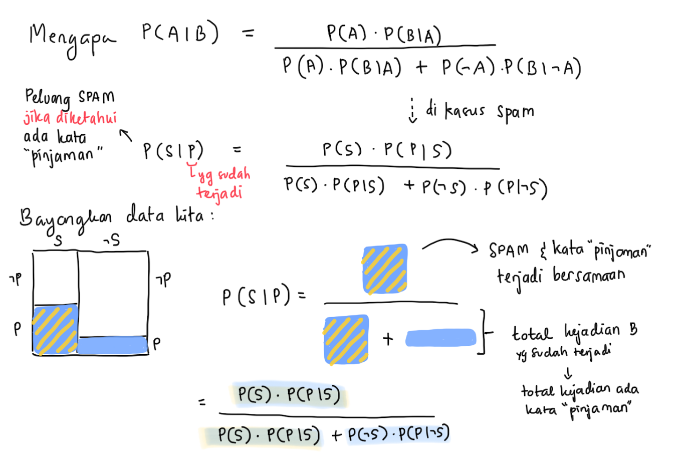
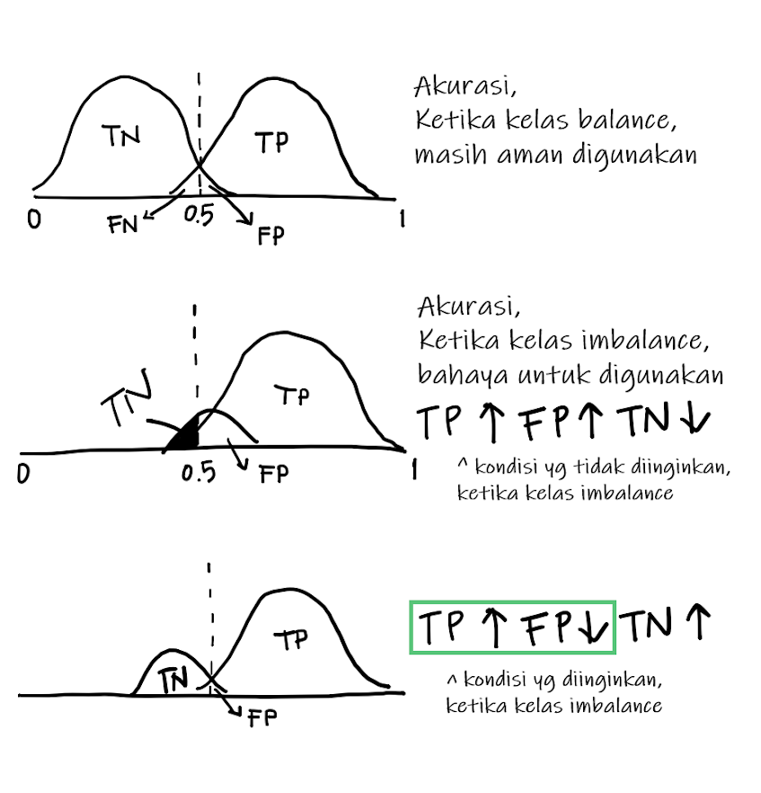

# Classification 2


## Classification in General

### **Dari berbagai metode klasifikasi yang telah dipelajari, yaitu Logistic Regression, KNN, Naive Bayes, Decision Tree, dan Random Forest, bagaimana pemilihan dalam penggunaan metode tersebut?**

Pemilihan metode klasifikasi bergantung pada tujuan analisis yang dilakukan. Secara umum, tujuan pemodelan klasifikasi adalah melakukan analisa terkait hubungan prediktor dengan target variabel atau melakukan prediksi.

Jika tujuannya adalah untuk melakukan analisa terkait hubungan antara prediktor dengan target variabel dapat menggunakan Logistic Regression atau Decision Tree. Berikut kelebihan dan kekurangan dari kedua metode tersebut.

   **Logistic Regression:**

* (+) model klasifikasi yang cukup sederhana dan komputasinya cepat
* (+) interpretabilitas yang tinggi dari formula yang dibentuk
* (+) tidak memerlukan scaling data
* (+) baseline yang baik sebelum mencoba model yang lebih kompleks
* (-) perlu ketelitian saat melakukan feature engineering karena sangat bergantung pada data yang fit
* (-) tidak dapat mengevaluasi hubungan yang non-linear antara log of odds dengan prediktornya
* (-) mengharuskan antar prediktornya tidak saling berkaitan (tidak ada multikolinearitas)

   **Decision Tree:**

* (+) tidak memerlukan scaling data
* (+) dapat mengevaluasi hubungan yang non-linear
* (+) antar prediktornya boleh saling berkaitan
* (+) interpretabilitas dari visualisasi pohon
* (-) sangat sensitif terhadap perubahan data, sehingga cenderung tidak stabil 
* (-) waktu komputasi relatif lebih lama 
* (-) rentan overfitting

Jika tujuannya adalah untuk melakukan prediksi dengan harapan performa yang baik, maka dapat menggunakan **Random Forest**. Metode klasifikasi ini merupakan gabungan dari beberapa Decision Tree, sehingga cukup robust (tidak sensitif) terhadap outlier, antar prediktor boleh saling berkaitan, bahkan mengatasi overfitting. Namun, kekurangannya Random Forest adalah model black-box yang artinya tidak dapat diinterpretasi secara detail.

**KNN** digunakan ketika prediktor-prediktor numerik masuk akal ketika kita melakukan klasifikasi berdasarkan kemiripan antar observasi. Namun KNN tidak melakukan pembuatan model sehingga waktu komputasi akan lama apabila kita berhadapan dengan data yang jumlahnya besar.

**Naive Bayes** sangat umum digunakan ketika terdapat sangat banyak prediktor karena komputasinya yang relatif lebih cepat dibanding model lain. Misalkan pada kasus text classification, yang prediktornya merupakan kata-kata yang unique pada dataset. Berikut merupakan link eksternal yang dapat dijadikan sebagai bahan referensi [The Naive Bayes Classifier](https://towardsdatascience.com/the-naive-bayes-classifier-e92ea9f47523)

### **Bagaimana cara mengembalikan hasil prediksi berupa probability pada metode klasifikasi?**

   Pada dasarnya, semua metode klasifikasi akan menghasilkan nilai probability, bukan langsung kelas. Secara default, metode klasifikasi akan mengembalikan kelas dengan threshold probabilitas 0.5. Tambahkan parameter `type` saat melakukan `predict()` untuk menghasilkan nilai probability. Berikut beberapa `type` untuk metode klasifikasi yang dipelajari:

  - `type = "response"` untuk Logistic Regression
  - `type = "raw"` untuk Naive Bayes
  - `type = "probability"` untuk Decision Tree dan Random Forest

### **Bagaimana cara handling imbalance data dengan metode SMOTE di R?**

Untuk melakukan balancing data menggunakan metode SMOTE di R dapat dilakukan dengan fungsi `SMOTE()` dari library `DMwR` seperti berikut

```r
data(iris)
data <- iris[, c(1, 2, 5)]
data$Species <- factor(ifelse(data$Species == "setosa","rare","common")) 
# checking the class distribution
prop.table(table(data$Species)) 
```

```
#> 
#>    common      rare 
#> 0.6666667 0.3333333
```

```r
## now using SMOTE to create a more "balanced problem"
library(DMwR)
newData <- SMOTE(Species ~ ., data, perc.over = 600, perc.under=100)
prop.table(table(newData$Species)) 
```

```
#> 
#>    common      rare 
#> 0.4615385 0.5384615
```
Berikut dokumentasi dari fungsi `SMOTE()` [SMOTE](https://www.rdocumentation.org/packages/DMwR/versions/0.4.1/topics/SMOTE)

## Text Cleansing

### **Bagaimana cara menghapus stopwords dalam Bahasa Indonesia?**

Daftar stopwords Bahasa Indonesia dapat diunduh terlebih dahulu melalui [GitHub](https://github.com/stopwords-iso/stopwords-id) berikut. Import file `stopwords id.txt` tersebut dengan menggunakan fungsi `readLines()`.


```r
# import Indonesia stopwords
stop_id <- readLines("data/05-C2/stopwords_id.txt")

# generate data frame
text <- data.frame(sentence = c("saya tertarik belajar data science di @algoritma :)",
                                "anda tinggal di Jakarta",
                                "Ingin ku merat🔥 na👍",
                                "selamat tahun baru #2020 !",
                                "pingin makan yang kek gitu"))
```

Mengubah text berbentuk data frame ke dalam bentuk corpus dengan menggunakan fungsi `VectorSource()` dan `VCorpus()` dari library `tm`. Setelah itu, aplikasikan fungsi `tm_map()` dan `removeWords()` untuk menghapus stopwords dari objek `stop_id`.


```r
text_clean1 <- text %>%
  pull(sentence) %>% 
  VectorSource() %>% 
  VCorpus() %>% 
  tm_map(removeWords, stop_id)

text_clean1[[1]]$content
```

```
#> [1] " tertarik belajar data science  @algoritma :)"
```

### **Bagaimana cara mengubah kata berimbuhan menjadi kata dasar dalam Bahasa Indonesia?**

Untuk mengubah kata berimbuhan menjadi kata dasar dalam bahasa Indonesia dapat menggunakan fungsi `katadasaR()` dari library `katadasaR`. Namun, fungsi tersebut hanya menerima 1 inputan kata saja sehingga dibutuhkan fungsi `sapply()` untuk mengaplikasikan fungsi tersebut ke dalam 1 kalimat.


```r
# membuat fungsi untuk mengubah kata berimbuhan menjadi kata dasar
kata_dasar <- function(x) {
  paste(sapply(words(x), katadasaR), collapse = " ")
  }
```

Menggunakan fungsi di atas dengan menggabungkan fungsi `tm_map()` dan `content_transformer()`.


```r
text_clean2 <- text %>%
  pull(sentence) %>% 
  VectorSource() %>% 
  VCorpus() %>% 
  tm_map(content_transformer(kata_dasar))

text_clean2[[1]]$content
```

```
#> [1] "saya tarik ajar data science di @algoritma :)"
```

### **Bagaimana cara menghapus emoticon dan emoji?**

Untuk menghapus emoticon dan emoji dapat menggunakan fungsi `replace_emoji()` dan `replace_emoticon()` dari library `textclean`. Kedua fungsi tersebut hanya menerima kalimat dengan tipe data berupa karakter, sehingga harus diubah terlebih dahulu tipe datanya jika masih belum karakter. 


```r
text_clean3 <- text %>%
  mutate(sentence = as.character(sentence)) %>% 
  pull(sentence) %>% 
  replace_emoji() %>% 
  replace_emoticon()

text_clean3
```

```
#> [1] "saya tertarik belajar data science di @algoritma smiley "
#> [2] "anda tinggal di Jakarta"                                 
#> [3] "Ingin ku merat<U+0001F525> na<U+0001F44D>"               
#> [4] "selamat tahun baru #2020 !"                              
#> [5] "pingin makan yang kek gitu"
```

### **Bagaimana cara menghapus mention dan hashtag?**

Untuk menghapus mention dan hashtag dapat menggunakan fungsi `replace_hash()` dan `replace_tag()` dari library `textclean`.


```r
text_clean4 <- text %>%
  mutate(sentence = as.character(sentence)) %>% 
  pull(sentence) %>% 
  replace_hash() %>% 
  replace_tag()

text_clean4
```

```
#> [1] "saya tertarik belajar data science di  :)"
#> [2] "anda tinggal di Jakarta"                  
#> [3] "Ingin ku merat<U+0001F525> na<U+0001F44D>"
#> [4] "selamat tahun baru  !"                    
#> [5] "pingin makan yang kek gitu"
```

### **Bagaimana cara menghapus slang words dalam Bahasa Indonesia?**

Daftar slang words Bahasa Indonesia dapat diunduh terlebih dahulu melalui [GitHub](https://github.com/nasalsabila/kamus-alay/blob/master/colloquial-indonesian-lexicon.csv) berikut.


```r
slang_id <- read.csv("data/05-C2/colloquial-indonesian-lexicon.csv") 
```

Untuk menghapus slang words dapat menggunakan fungsi `replace_internet_slang()` dari library `textclean`.


```r
text_clean5 <- text %>%
  mutate(sentence = as.character(sentence)) %>% 
  pull(sentence) %>%
  replace_internet_slang(slang = paste0('\\b', slang_id$slang, '\\b') , 
                         replacement = slang_id$formal, 
                         ignore.case = T)

text_clean5
```

```
#> [1] "saya tertarik belajar data science di @algoritma :)"
#> [2] "anda tinggal di Jakarta"                            
#> [3] "Ingin ku merat<untuk+0001F525> nya<untuk+0001F44D>" 
#> [4] "selamat tahun baru #2020 !"                         
#> [5] "pengin makan yang kayak begitu"
```

Berikut link eksternal yang dapat dijadikan sebagai bahan referensi dalam melakukan cleaning text:

- [Text Cleaning Bahasa Indonesia](https://algotech.netlify.com/blog/text-cleaning-bahasa/)
- [Text Cleaning Bahasa Inggris](https://algotech.netlify.com/blog/textclean/)

### **Selain proses stemming apakah bisa menggunakan lemmatization untuk memisahkan kata dasar dengan imbuhan?**

Proses stemming bertujuan untuk menghilangkan imbuhan dari suatu kata berimbuhan. Pada stemming bahasa inggris misalnya fungsi stemming akan menghapus suku kata d, ed, s, es, ing, etc. Sehingga, ada kemungkinan terdapat kata-kata yang hasil stemmingnya kurang tepat seperti "balance". Namun, hal ini tidak akan berpengaruh terhadap hasil pemodelan karena kata yang dihasilkan sama/seragam (dianggap sebagai satu prediktor yang sama). Hal ini karena komputer/machine learning tidak memahami/mengerti konteks/makna dari kata tersebut. Namun, hal ini akan cukup menggangu ketika melakukan visualisasi seperti membuat wordcloud. 

Solusinya dapat mencoba alternatif lain, yaitu lemmatization. Berbeda dengan stemming, lemmatization dapat memisahkan kata dasar dengan kata imbuhannya secara tepat. Hal ini karena, secara sederhana lemmatization bekerja seperti ketika kita menghapus stopwords, dimana kita sebenarnya mempunyai kamus besar yang berisi berbagai macam jenis kata berimbuhan dan kata dasarnya. 

Penjelasan secara detail tentang stemming dan lemmatization dapat dibaca melalui [Stemming and lemmatization](https://nlp.stanford.edu/IR-book/html/htmledition/stemming-and-lemmatization-1.html) dan [textstem package](https://cran.r-project.org/web/packages/textstem/README.html)

### **Bagaiaman proses tokenization untuk pasangan kata?**

Tokenization pasangan kata, seperti "saya pergi", "tidak suka", etc. adalah salah satu tahapan yang umum dilakukan di n-gram analysis (bigram analysis bila terdapat 2 pasangan kata). Hal tersebut umumnya dilakukan pada kasus analisis korelasi antar kata. Berikut beberapa artikel yang mengaplikasikan proses tokenization pasangan kata:

- [4 Relationships between words: n-grams and correlations](https://www.tidytextmining.com/ngrams.html)
- [TEXT GENERATION WITH MARKOV CHAINS](https://algotech.netlify.app/blog/text-generating-with-markov-chains/) 
- [Topic Modelling with LDA](https://rpubs.com/Argaadya/topic_lda)

## Naive Bayes

### **Apakah metode Naive Bayes dapat diterapkan untuk prediktor bertipe numerik?**

Naive bayes dapat diterapkan pada berbagai permasalahan klasifikasi, tidak terbatas pada klasifikasi text. Jika prediktor yang digunakan bertipe numerik, Naive Bayes akan menghitung rata-rata (mean) dan standard deviation (sd) untuk setiap level target. Peluang didapatkan dengan mengasumsikan bahwa prediktor numerik memiliki distribusi normal. Tipe Naive Bayes ini disebut sebagai Gaussian Naive Bayes. Berikut contoh naive bayes pada data `iris`.


```r
naiveBayes(Species ~ ., iris)
```

```
#> 
#> Naive Bayes Classifier for Discrete Predictors
#> 
#> Call:
#> naiveBayes.default(x = X, y = Y, laplace = laplace)
#> 
#> A-priori probabilities:
#> Y
#>     setosa versicolor  virginica 
#>  0.3333333  0.3333333  0.3333333 
#> 
#> Conditional probabilities:
#>             Sepal.Length
#> Y             [,1]      [,2]
#>   setosa     5.006 0.3524897
#>   versicolor 5.936 0.5161711
#>   virginica  6.588 0.6358796
#> 
#>             Sepal.Width
#> Y             [,1]      [,2]
#>   setosa     3.428 0.3790644
#>   versicolor 2.770 0.3137983
#>   virginica  2.974 0.3224966
#> 
#>             Petal.Length
#> Y             [,1]      [,2]
#>   setosa     1.462 0.1736640
#>   versicolor 4.260 0.4699110
#>   virginica  5.552 0.5518947
#> 
#>             Petal.Width
#> Y             [,1]      [,2]
#>   setosa     0.246 0.1053856
#>   versicolor 1.326 0.1977527
#>   virginica  2.026 0.2746501
```

## Tree-based Model


### **Apa yang dimaksud dengan ensemble method?**

Ensemble method merupakan gabungan prediksi dari beberapa model menjadi prediksi tunggal. Random forest merupakan salah satu jenis ensemble method untuk kasus klasifikasi yang memanfaatkan konsep *Bagging*, yaitu gabungan dari **Bootstrap** dan **Aggregation**. 

- Bootstrap merupakan proses pengambilan sampel dengan pengembalian, adanya pengembalian memiliki kemungkinan data yang diambil berulang (baris terduplikasi). Setiap observasi memiliki peluang yang sama untuk dijadikan sampel.

- Aggregation, dari beberapa model yang telah terbentuk dikumpulkan semua hasil prediksi untuk menentukan hasil prediksi tunggal. Untuk klasifikasi, maka dilakukan `majority voting` dimana kelas yang paling banyak diprediksi akan menjadi targetnya. Sedangkan untuk regresi akan diperoleh nilai rata-rata targetnya dari setiap model.

### **Secara default, Random Forest akan membangun sebanyak 500 tree. Bagaimana cara mengubahnya?**

Gunakan parameter `ntree` pada fungsi `train()`. Misalnya kita hanya ingin membuat 100 trees, agar komputasinya lebih cepat. Pada finalModel kita dapat lihat bahwa Number of trees yang dipakai adalah 100.


```r
set.seed(100)
diab_forest_100 <- train(diabetes ~ .,
                         data = diab,
                         method = "rf",
                         ntree = 100)
```


```r
diab_forest_100$finalModel$param
```

```
#> $ntree
#> [1] 100
```

### **Secara default, Random Forest akan mencoba 3 nilai `mtry`. Bagaimana cara mengubahnya?**

Gunakan parameter `tuneGrid` pada fungsi `train()` dengan menyiapkan dataframe dari `expand.grid()` berupa daftar kemungkinan nilai dari parameter `mtry`. Misalkan saya hanya ingin Random Forest yang menggunakan mtry 4 dan 5:


```r
grid <- expand.grid(mtry = c(4, 5))
grid
```

```
#>   mtry
#> 1    4
#> 2    5
```


```r
set.seed(100)
diab_forest_tune <- train(diabetes ~ .,
                          data = diab,
                          method = "rf",
                          tuneGrid = grid)
```


```r
diab_forest_tune
```

```
#> Random Forest 
#> 
#> 768 samples
#>   8 predictor
#>   2 classes: 'neg', 'pos' 
#> 
#> No pre-processing
#> Resampling: Bootstrapped (25 reps) 
#> Summary of sample sizes: 768, 768, 768, 768, 768, 768, ... 
#> Resampling results across tuning parameters:
#> 
#>   mtry  Accuracy   Kappa    
#>   4     0.7539355  0.4467487
#>   5     0.7552129  0.4498807
#> 
#> Accuracy was used to select the optimal model using the largest value.
#> The final value used for the model was mtry = 5.
```


### Secara default, Random Forest akan memilih model dengan Accuracy terbaik. Bagaimana cara mengubahnya agar menggunakan metric Precision atau Recall atau bahkan AUC?

Terdapat parameter pada fungsi `trainControl()`:

- `summaryFunction = prSummary` untuk menghitung nilai precision-recall
- `classProbs = TRUE` untuk perhitungan nilai AUC

Kemudian gunakan parameter `metric` pada fungsi `train()` untuk memilih `metric` mana yang ingin diunggulkan: `"AUC"`, `"Precision"`, `"Recall"`, atau `"F"`. Misalkan untuk kasus prediksi diabetes, karena ingin meminimalisir kasus False Negative berarti kita berharap untuk mendapatkan model dengan metric Recall tertinggi.


```r
set.seed(100)
ctrl <- trainControl(summaryFunction = prSummary,
                     classProbs = TRUE)

diab_forest_pr <- train(diabetes ~ .,
                        data = diab,
                        method = "rf",
                        trControl = ctrl,
                        metric = "Recall")
```


```r
diab_forest_pr
```

```
#> Random Forest 
#> 
#> 768 samples
#>   8 predictor
#>   2 classes: 'neg', 'pos' 
#> 
#> No pre-processing
#> Resampling: Bootstrapped (25 reps) 
#> Summary of sample sizes: 768, 768, 768, 768, 768, 768, ... 
#> Resampling results across tuning parameters:
#> 
#>   mtry  AUC        Precision  Recall     F        
#>   2     0.8855808  0.8011553  0.8435644  0.8211170
#>   5     0.8642503  0.8055431  0.8294605  0.8165980
#>   8     0.8412353  0.7993967  0.8226283  0.8101388
#> 
#> Recall was used to select the optimal model using the largest value.
#> The final value used for the model was mtry = 2.
```


### **Bagaimana implementasi model regresi pada Random Forest?**

Import data yang akan digunakan:


```r
insurance <- read.csv("data/05-C2/insurance.csv")
head(insurance)
```

```
#>   age    sex    bmi children smoker    region   charges
#> 1  19 female 27.900        0    yes southwest 16884.924
#> 2  18   male 33.770        1     no southeast  1725.552
#> 3  28   male 33.000        3     no southeast  4449.462
#> 4  33   male 22.705        0     no northwest 21984.471
#> 5  32   male 28.880        0     no northwest  3866.855
#> 6  31 female 25.740        0     no southeast  3756.622
```

Lakukan cross validation dengan fungsi `initial_split` pada library `rsample`:


```r
set.seed(100)
idx <- initial_split(insurance, prop = 0.8)

# check train dataset
train <- training(idx) 

# check test dataset
test <- testing(idx) 
```

Cara membuat model regresi dengan Random Forest tidak berbeda dengan kasus klasifikasi, ketika target variabel yang digunakan bertipe numerik, otomatis model akan menghasilkan model regresi.


```r
set.seed(100)
ctrl <- trainControl(method = "repeatedcv",
                     number = 5,
                     repeats = 3)

insurance_forest <- train(charges ~ .,
                          data = train,
                          method = "rf",
                          trControl = ctrl)
```


```r
insurance_forest
```

```
#> Random Forest 
#> 
#> 857 samples
#>   6 predictor
#> 
#> No pre-processing
#> Resampling: Cross-Validated (5 fold, repeated 3 times) 
#> Summary of sample sizes: 685, 686, 685, 687, 685, 685, ... 
#> Resampling results across tuning parameters:
#> 
#>   mtry  RMSE      Rsquared   MAE     
#>   2     5478.898  0.8335458  3708.914
#>   5     4822.793  0.8433103  2729.368
#>   8     4944.418  0.8365218  2827.233
#> 
#> RMSE was used to select the optimal model using the smallest value.
#> The final value used for the model was mtry = 5.
```

Melakukan prediksi pada data test dan evaluasi model menggunakan nilai RMSE:


```r
test$pred <- predict(object = insurance_forest, newdata = test)
RMSE(y_pred = test$pred, y_true = test$charges)
```

```
#> [1] 3891.623
```

## Model Evaluation

### **Jelaskan kegunaan dari ROC dan AUC?**

Kurva ROC (Receiver Operating Characteristic) menggambarkan seberapa baik kinerja model klasifikasi biner. Kurva ROC dibentuk dari nilai TPR (True Positive Rate) dan FPR (False Positive Rate) untuk semua nilai threshold dari 0 hingga 1. AUC (Area Under the Curve) adalah luas daerah dari kurva ROC. Nilai AUC mendekati 1 artinya model sangat baik, ketika nilai AUC berada di sekitar 0.5 maka model tersebut memiliki performance yang tidak baik dan hanya menebak secara random.

### **Apakah k-fold cross validation dapat digunakan untuk metode klasifikasi selain Random Forest?**

  k-fold cross validation dapat digunakan untuk semua metode klasifikasi bahkan di luar metode yang telah dipelajari. Namun, karena k-fold cross validation tidak memperlihatkan hasil pemodelan untuk semua subset data (hanya mengambil model dengan performa terbaik), maka tetap perlu dilakukan cross validation untuk melakukan evaluasi model. Berikut contoh k-fold cross validation untuk metode Decision Tree:
  

```r
set.seed(417)
ctrl <- trainControl(method = "repeatedcv", number = 5, repeats = 3)
# parameter method dapat disesuaikan dengan metode klasifikasi yang digunakan
model <- train(attrition ~ .,
               data = train,
               method = "ctree",
               trControl = ctrl)
```

## Mathematics Concept

### **Bayes Theorem**




### **Independent Event**

Ketika ada 2 kejadian yang terjadi secara bersamaan, peluang satu kejadian tidak mempengaruhi kejadian yang lain. Maka, peluang terjadi 2 kejadian yang tidak saling berhubungan adalah hasil **perkalian** masing-masing peluang kejadian tersebut.

$$P(A \cap B) = P(A) \ P(B)$$

### **Dependent Event**

Peluang satu kejadian dipengaruhi atau berubah sesuai dengan informasi tentang kejadian lainnya. Untuk menghitung peluangnya, kita bisa menggunakan **Bayes Theorem**.

$$P(A|B) = \frac{P(B|A) P(A)}{P(B)} = \frac{P(B|A) P(A)}{P(B|A) P(A)\ +\  P(B|\neg A) P(\neg A)}$$

- $P(A|B)$: Peluang terjadi A apabila diketahui B telah terjadi.
- $P(B|A)$: Peluang terjadi B apabila diketahui A telah terjadi.
- $P(B|\neg A)$: Peluang terjadi B apabila diketahui A tidak terjadi.
- $P(A)$: Peluang terjadi A
- $P(\neg A)$: Peluang tidak terjadi A

### **Entropy**

Entropy adalah ukuran ketidakteraturan (measure of disorder) yang bisa digunakan untuk mewakili seberapa beragam kelas yang ada dalam suatu variabel.

$$Entropy = \Sigma_{i=1}^c -p_i \ log_2 \ p_i$$

Nilai entropy apabila dalam satu variabel terdapat 2 kelas atau nilai:

$$Entropy = -\ p_1 \ log_2 \ p_1 -p_2 \ log_2 \ p_2$$

- $p_i$: proporsi kelas ke-*i* (jumlah observasi kelas *i* dibagi total seluruh observasi)

### **Information Gain**

Information Gain digunakan untuk mengukur perubahan Entropy dan tingkat keragaman kelas setelah dilakukan percabangan. Ketika kita memisahkan 1 data menjadi 2 cabang menggunakan variabel tertentu, information gain dipakai untuk menentukan variabel mana yang dapat memberikan penurunan Entropy yang paling besar.

$$Information \ Gain = Entropy(awal) - (P_1 \  Entropy_1 + P_2 \  Entropy_2)$$

- $P_1$: proporsi data pada cabang kiri
- $Entropy_1$: nilai entropy pada cabang kiri
- $P_2$: proporsi data pada cabang kanan
- $Entropy_2$: nilai entropy pada cabang kanan

Untuk mencari variabel terbaik yang bisa digunakan untuk memisahkan dua kelas supaya entropy-nya semakin kecil, kita cari nilai Information Gain untuk tiap variabel dan pilih variable yang memberikan Information Gain terbesar sebagai percabangannya.

### **Gini Index**

Gini index adalah alternatif dari nilai Entropy. Secara komputasi, Gini lebih cepat dibandingkan Entropy karena hanya berupa perkalian, sedangkan Entropy menggunakan fungsi logaritma.

$$Gini = \Sigma_{i=1}^C\ p(i)\ (1-p(i))$$

Sehingga Gini untuk 2 kelas:

$$Gini =  p(a)\ (1-p(a))\ +\  p(b)\ (1-p(b))$$

### **Variable Importance**

Variable Importance yang dihitung oleh Random Forest didapatkan dari rumus Gini Importance, yang konsepnya sama dengan Information Gain. Namun Gini Importance menggunakan Gini Index, bukan nilai Entropy.

$$Gini\ Importance = Gini_{awal} - (P_1\ Gini_1 + P_2\ Gini_2)$$

### **ROC Curve**

Berikut ini ilustrasi yang menggambarkan kondisi ROC (Receiver Operating characteristic) Curve yang diinginkan ketika kelas imbalance adalah mendapatkan *True Positive* setinggi mungkin dan *False Positive* serendah mungkin.


