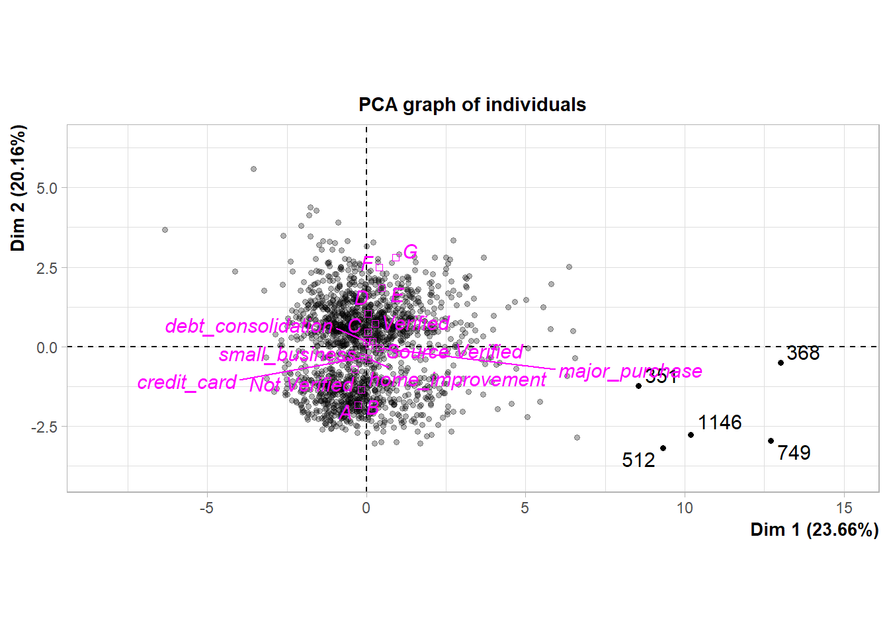
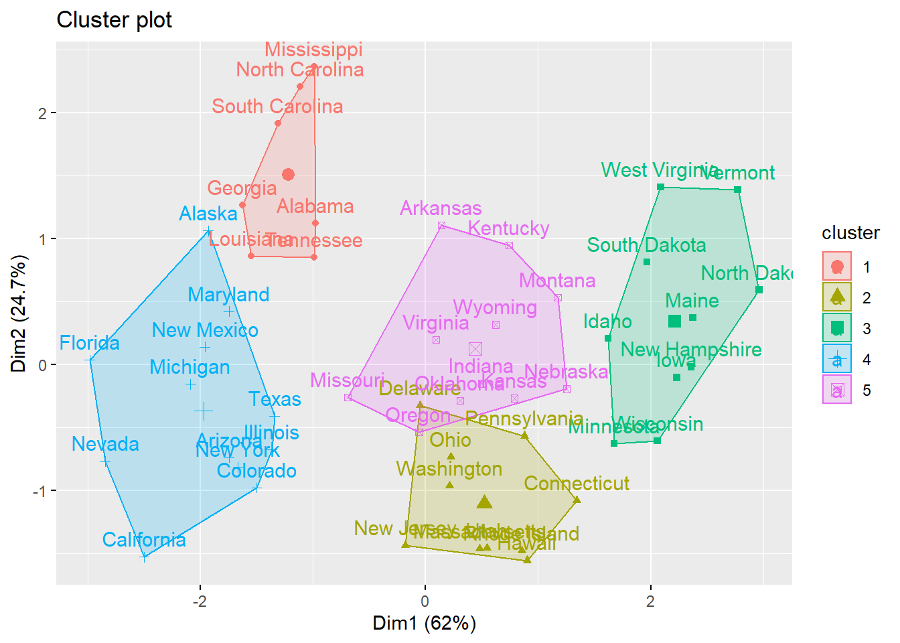
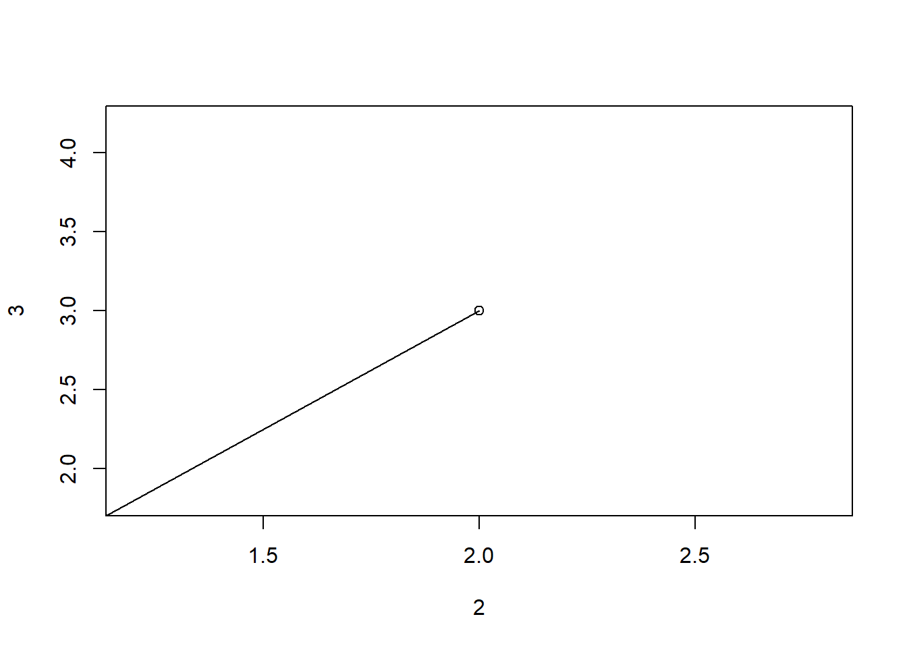
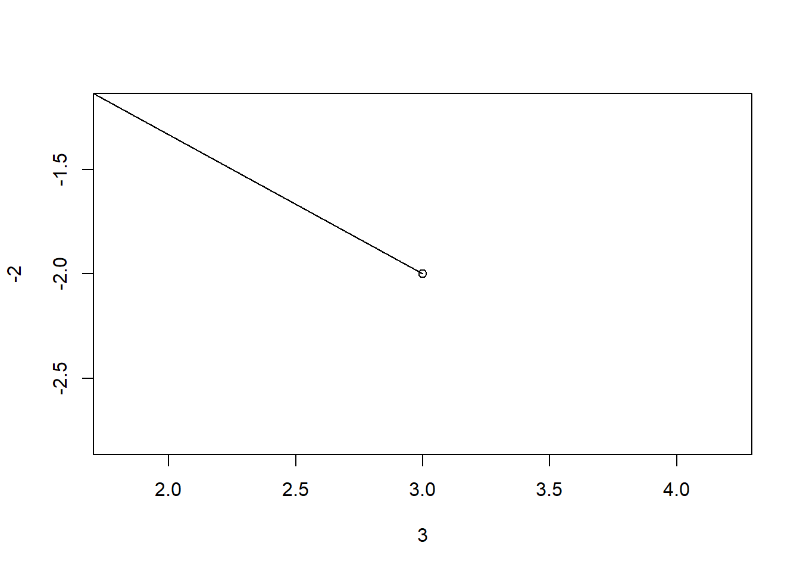

# Unsupervised Learning


## PCA: Dimensionality Reduction

### **Permasalahan apa yang terdapat pada data berdimensi tinggi?**

  - menyulitkan pengolahan data
  - memerlukan komputasi yang besar
  - tidak efisien secara waktu

###  **Perbedaan membuat PCA dengan menggunakan fungsi `prcomp()` dan `PCA()` dari library `FactoMineR`?**

Fungsi untuk membuat biplot di R:

- `biplot(prcomp())` -> base R
- `plot.PCA(PCA())` -> package `FactoMineR`

Kelebihan ketika membuat PCA dengan menggunakan fungsi `PCA()` dari library `FactoMineR` adalah bisa membuat biplot lebih spesifik:
  
- memisahkan dua grafik yang terdapat pada biplot yaitu **individual factor map** dan **variables factor map**
- mengkombinasikan antara variabel **numerik dan kategorik** dengan menggunakan fungsi `plot.PCA()`. 

### **Apakah terdapat best practice dalam menentukan jumlah PC yang digunakan pada PCA? **

   Penentuan jumlah PC yang digunakan bergantung pada kebutuhan analisa yang dilakukan. Namun, kembali pada tujuan awal melakukan PCA, yaitu untuk mereduksi dimensi supaya analisis lanjutan yang dilakukan memiliki waktu yang relatif cepat dan ruang penyimpanan yang lebih efisien. Sehingga, seringkali seorang analis menentapkan threshold lebih dari 70-75% informasi. Maksudnya jumlah PC yang digunakan adalah jumlah PC yang sudah merangkum kurang lebih 70-75% informasi. Namun, threshold tersebut sifatnya tidak mutlak artinya disesuaikan dengan kebutuhan analisis dan bisnis. Berikut merupakan link eksternal yang dapat dijadikan sebagai bahan referensi [How many components can I retrieve in principal component analysis?](https://www.researchgate.net/post/How_many_components_can_I_retrieve_in_principal_component_analysis).

### **Bagaimana implementasi PCA pada data pre-processing?**

Berikut ini adalah implementasi PCA pada tahapan data pre-processing dengan menggunakan data `attrition`.


```r
attrition <- read.csv("data/06-UL/attrition.csv")
str(attrition)
```

```
#> 'data.frame':	1470 obs. of  35 variables:
#>  $ attrition                 : chr  "yes" "no" "yes" "no" ...
#>  $ age                       : int  41 49 37 33 27 32 59 30 38 36 ...
#>  $ business_travel           : chr  "travel_rarely" "travel_frequently" "travel_rarely" "travel_frequently" ...
#>  $ daily_rate                : int  1102 279 1373 1392 591 1005 1324 1358 216 1299 ...
#>  $ department                : chr  "sales" "research_development" "research_development" "research_development" ...
#>  $ distance_from_home        : int  1 8 2 3 2 2 3 24 23 27 ...
#>  $ education                 : int  2 1 2 4 1 2 3 1 3 3 ...
#>  $ education_field           : chr  "life_sciences" "life_sciences" "other" "life_sciences" ...
#>  $ employee_count            : int  1 1 1 1 1 1 1 1 1 1 ...
#>  $ employee_number           : int  1 2 4 5 7 8 10 11 12 13 ...
#>  $ environment_satisfaction  : int  2 3 4 4 1 4 3 4 4 3 ...
#>  $ gender                    : chr  "female" "male" "male" "female" ...
#>  $ hourly_rate               : int  94 61 92 56 40 79 81 67 44 94 ...
#>  $ job_involvement           : int  3 2 2 3 3 3 4 3 2 3 ...
#>  $ job_level                 : int  2 2 1 1 1 1 1 1 3 2 ...
#>  $ job_role                  : chr  "sales_executive" "research_scientist" "laboratory_technician" "research_scientist" ...
#>  $ job_satisfaction          : int  4 2 3 3 2 4 1 3 3 3 ...
#>  $ marital_status            : chr  "single" "married" "single" "married" ...
#>  $ monthly_income            : int  5993 5130 2090 2909 3468 3068 2670 2693 9526 5237 ...
#>  $ monthly_rate              : int  19479 24907 2396 23159 16632 11864 9964 13335 8787 16577 ...
#>  $ num_companies_worked      : int  8 1 6 1 9 0 4 1 0 6 ...
#>  $ over_18                   : chr  "y" "y" "y" "y" ...
#>  $ over_time                 : chr  "yes" "no" "yes" "yes" ...
#>  $ percent_salary_hike       : int  11 23 15 11 12 13 20 22 21 13 ...
#>  $ performance_rating        : int  3 4 3 3 3 3 4 4 4 3 ...
#>  $ relationship_satisfaction : int  1 4 2 3 4 3 1 2 2 2 ...
#>  $ standard_hours            : int  80 80 80 80 80 80 80 80 80 80 ...
#>  $ stock_option_level        : int  0 1 0 0 1 0 3 1 0 2 ...
#>  $ total_working_years       : int  8 10 7 8 6 8 12 1 10 17 ...
#>  $ training_times_last_year  : int  0 3 3 3 3 2 3 2 2 3 ...
#>  $ work_life_balance         : int  1 3 3 3 3 2 2 3 3 2 ...
#>  $ years_at_company          : int  6 10 0 8 2 7 1 1 9 7 ...
#>  $ years_in_current_role     : int  4 7 0 7 2 7 0 0 7 7 ...
#>  $ years_since_last_promotion: int  0 1 0 3 2 3 0 0 1 7 ...
#>  $ years_with_curr_manager   : int  5 7 0 0 2 6 0 0 8 7 ...
```

Sebelum melakukan PCA terlebih dahulu dilakukan cross validation, yaitu membagi data menjadi **training set** untuk proses pemodelan dan **testing set** untuk melakukan evaluasi. Namun, data train dan data test tidak langsung dimasukkan ke dalam sebuah objek melainkan dilakukan PCA terlebih dahulu.

Cross validation akan dilakukan dengan menggunakan fungsi `initial_split()` dari library `rsample`. Fungsi tersebut akan melakukan proses sampling untuk cross validation dengan metode **stratified random sampling**, sehingga proporsi target variabel pada data awal, akan dipertahankan baik pada training set maupun testing set.


```r
set.seed(417)
splitted <- initial_split(data = attrition,
                          prop = 0.8,
                          strata = "attrition")
splitted
```

```
#> <Analysis/Assess/Total>
#> <1177/293/1470>
```

Melakukan tahapan data preparation yang didalamnya termasuk melakukan PCA. Data preparation yang akan dilakukan adalah menghapus variabel yang dianggap tidak berpengaruh, membuang variabel yang variansinya mendekati 0 (tidak informatif), melakukan scaling, dan melakukan PCA. Proses yang dilakukan pada tahapan data preparation akan dilakukan dengan menggunakan fungsi dari library `recipes`, yaitu:

- `step_rm()` untuk menghapus variabel
- `step_nzv()` untuk membuang variabel yang variansinya mendekati 0
- `step_center()` dan `step_scale()` untuk melakukan scaling
- `step_pca()` untuk melakukan PCA


```r
rec <- recipe(attrition ~ ., training(splitted)) %>% 
  step_rm(employee_count, employee_number) %>%
  step_nzv(all_predictors()) %>% 
  step_center(all_numeric()) %>% 
  step_scale(all_numeric()) %>% 
  step_pca(all_numeric(), threshold = 0.8) %>% 
  prep()
```

Setelah mendefinisikan proses data preparation pada objek `rec`, selanjutnya proses tersebut diterapkan ke data train menggunakan fungsi `juice()` dan ke data test menggunakan fungsi `bake()` dari library `recipes`.


```r
train <- juice(rec)
head(train, 5)
```

```
#> # A tibble: 5 x 21
#>   business_travel department education_field gender job_role marital_status
#>   <fct>           <fct>      <fct>           <fct>  <fct>    <fct>         
#> 1 travel_rarely   sales      life_sciences   female sales_e~ single        
#> 2 travel_frequen~ research_~ life_sciences   male   researc~ married       
#> 3 travel_rarely   research_~ other           male   laborat~ single        
#> 4 travel_frequen~ research_~ life_sciences   female researc~ married       
#> 5 travel_rarely   research_~ medical         male   laborat~ married       
#> # ... with 15 more variables: over_time <fct>, attrition <fct>, PC01 <dbl>,
#> #   PC02 <dbl>, PC03 <dbl>, PC04 <dbl>, PC05 <dbl>, PC06 <dbl>, PC07 <dbl>,
#> #   PC08 <dbl>, PC09 <dbl>, PC10 <dbl>, PC11 <dbl>, PC12 <dbl>, PC13 <dbl>
```


```r
test <- bake(rec, testing(splitted))
head(test, 5)
```

```
#> # A tibble: 5 x 21
#>   business_travel department education_field gender job_role marital_status
#>   <fct>           <fct>      <fct>           <fct>  <fct>    <fct>         
#> 1 travel_rarely   research_~ medical         female laborat~ married       
#> 2 travel_rarely   research_~ life_sciences   male   laborat~ divorced      
#> 3 travel_rarely   research_~ medical         male   healthc~ married       
#> 4 travel_rarely   research_~ medical         male   laborat~ divorced      
#> 5 travel_rarely   research_~ life_sciences   male   laborat~ single        
#> # ... with 15 more variables: over_time <fct>, attrition <fct>, PC01 <dbl>,
#> #   PC02 <dbl>, PC03 <dbl>, PC04 <dbl>, PC05 <dbl>, PC06 <dbl>, PC07 <dbl>,
#> #   PC08 <dbl>, PC09 <dbl>, PC10 <dbl>, PC11 <dbl>, PC12 <dbl>, PC13 <dbl>
```

Dari output di atas diketahui bahwa variabel numerik sudah berbentuk sebuah PC. Selanjutnya, data sudah siap dilanjutkan ke tahap modeling.

### **Bagaimana penerapan PCA di industri?**

  PCA pada industri lebih sering digunakan untuk data preparation sama halnya seperti scaling, feature engineering, ataupun feature selection. PCA digunakan untuk mereduksi data berdimensi besar besar menjadi lebih kecil, secara sederhana dapat dikatakan mengurangi jumlah kolom pada data. Walaupun begitu, PCA tetap mempertahankan informasi dari semua variabel. Sebelum mereduksi dimensi, PCA akan merangkum terlebih dahulu semua informasi yang terdapat pada setiap variabel ke dalam bentuk PC, PC tersebut yang nantinya akan direduksi (dikurangi) dimensinya. Oleh karena itu, variabel yang digunakan jumlahnya tetap sama seperti data awal, hanya informasi (variansinya) saja yang berkurang. Berikut merupakan link eksternal yang dapat dijadikan sebagai bahan referensi [An Application of PCA](https://web.cs.ucdavis.edu/~vemuri/papers/pcaVisualization.pdf).

   Contoh permasalahan yang sering ditemui adalah klasifikasi dokumen. Saat ini semua administrasi dilakukan secara online/elektronik (tidak manual), adakalanya seorang nasabah/pelamar/customer harus melakukan upload dokumen. Sebelum adanya klasifikasi dokumen, pengecekkan kebenaran dokumen dilakukan secara manual sehingga membutuhkan waktu yang cukup lama dan kapasitas penyimpanan yang relatif besar karena aplikasi tidak mampu memilah mana dokumen yang sudah sesuai dan mana yang belum. Namun, permasalahan tersebut sudah mampu terjawab dengan adanya klasifikasi dokumen. Data untuk klasifikasi dokumen adalah data image yang jika dilakukan proses klasifikasi akan memerlukan komputasi yang relatif lama dibandingkan data tabular biasa. Oleh karena itu, perlu dilakukan PCA untuk mereduksi dimensi data image tersebut supaya komputasi saat proses klasifikasi bisa menjadi lebih cepat. Berikut merupakan link eksternal yang dapat dijadikan sebagai bahan referensi [Image Compression with PCA in R](https://www.r-bloggers.com/image-compression-with-pca-in-r/).

## PCA: Visualization

### **Apakah biplot dapat menampilkan PC lain selain PC1 dan PC2?**

  Bisa, tetapi informasi yang dijelaskan menjadi berkurang, karena secara default PC1 dan PC2 merangkum informasi paling banyak. Berikut contoh membuat biplot dengan menggunakan PC lain (selain PC1 dan PC2):
  

```r
head(USArrests)
```

```
#>            Murder Assault UrbanPop Rape
#> Alabama      13.2     236       58 21.2
#> Alaska       10.0     263       48 44.5
#> Arizona       8.1     294       80 31.0
#> Arkansas      8.8     190       50 19.5
#> California    9.0     276       91 40.6
#> Colorado      7.9     204       78 38.7
```

Membuat PCA dari data `USArrests` dengan menggunakan fungsi `prcomp()`.


```r
pca_us <- prcomp(USArrests, scale = T)
```

Membuat visualisasi dari hasil PCA dengan menggunakan fungsi `biplot()`.


```r
# parameter `choices` dapat diganti sesuai PC yang ingin dibuat, secara default menggunakan  PC1 dan PC2 (choices = 1:2)
biplot(pca_us, choices = 2:3)
```


   
### **Apakah kita dapat memvisualisasikan biplot dengan 3 dimensi?**

Untuk menampilkan biplot dengan 3 dimensi dapat menggunakan function `plot_ly()` dari package `plotly`. Berikut ini akan dicontohkan memvisualisasikan biplot dari PC1, PC2, PC3 dan juga akan dibedakan setiap titik observasi dengan cluster nya. Sebelum masuk ke visualisasi, akan dicari terlebih dahulu cluster untuk setiap observasi.


```r
# Read data in
whiskies <- read.csv("data/06-UL/whiskies.txt")

# Distillery column is the name of each whisky
rownames(whiskies) <- whiskies[,"Distillery"]

# remove RowID, Postcode, Latitude and Longitude
whiskies <- whiskies[,3:14]

# k-means clustering
whi_km <- kmeans(scale(whiskies), 4)
```

Setelah menggunakan `kmeans()` untuk mendapatkan cluster, berikutnya kita lakukan PCA dan membentuk PC yang diperoleh dalam bentuk data frame.


```r
whis.pca <- PCA(whiskies, graph = F, scale.unit = T)
df_pca <- data.frame(whis.pca$ind$coord) %>% 
          bind_cols(cluster = as.factor(whi_km$cluster))
head(df_pca)
```

```
#>                   Dim.1      Dim.2      Dim.3      Dim.4       Dim.5 cluster
#> Aberfeldy   -0.65565655  1.2056463 -0.1663438 -0.7807432  0.14526590       1
#> Aberlour    -2.31263102  3.7479878  1.3669186  0.8719922  0.69366566       1
#> AnCnoc      -1.60215288 -0.6640822 -0.2972053 -1.1027897 -0.01535638       4
#> Ardbeg       5.41363278  0.2448746  1.2101422 -0.7483052 -0.19536723       3
#> Ardmore      0.12164922  0.4127927 -0.3044621 -1.2705758  1.49597271       2
#> ArranIsleOf  0.09941062 -1.3966133 -1.2024542  1.6549138 -0.28659985       4
```
 
Visualisasikan PC dan membedakan warna tiap observasi berdasarkan clusternya.


```r
plot_ly(df_pca, x = ~Dim.1, y = ~Dim.2, z = ~Dim.3, color = ~cluster)
```

### **Bagaimana implementasi visualisasi PCA menggunakan package `factoextra`?**

Kita akan mencoba melakukan visualisasi pada data setelah dilakukan PCA dengan menggunakan data `loan`.


```r
loan <- read.csv("data/06-UL/loan2017Q4.csv")
str(loan)
```

```
#> 'data.frame':	1556 obs. of  16 variables:
#>  $ initial_list_status: chr  "w" "f" "w" "w" ...
#>  $ purpose            : chr  "debt_consolidation" "debt_consolidation" "debt_consolidation" "debt_consolidation" ...
#>  $ int_rate           : num  14.08 9.44 28.72 13.59 15.05 ...
#>  $ installment        : num  676 480 1010 484 476 ...
#>  $ annual_inc         : num  156700 50000 25000 175000 109992 ...
#>  $ dti                : num  19.1 19.4 65.6 12.6 10 ...
#>  $ verification_status: chr  "Source Verified" "Not Verified" "Verified" "Not Verified" ...
#>  $ grade              : chr  "C" "B" "F" "C" ...
#>  $ revol_bal          : int  21936 5457 23453 31740 2284 2016 14330 27588 27024 11719 ...
#>  $ inq_last_12m       : int  3 1 0 0 3 5 0 1 8 1 ...
#>  $ delinq_2yrs        : int  0 1 0 0 0 0 0 0 0 0 ...
#>  $ home_ownership     : chr  "MORTGAGE" "RENT" "OWN" "MORTGAGE" ...
#>  $ not_paid           : int  0 1 1 1 0 1 0 1 1 0 ...
#>  $ log_inc            : num  12 10.8 10.1 12.1 11.6 ...
#>  $ verified           : int  1 0 1 0 0 0 0 0 1 1 ...
#>  $ grdCtoA            : int  0 1 0 0 0 1 0 1 0 0 ...
```

Sebelum melakukan PCA kita akan melakukan tahapan data preparation terlebih dahulu dengan membuang variabel `initial_list_status`, `home_ownership`, dan `not_paid` karena visualisasi yang akan dibuat tidak memerlukan insight dari ketiga variabel tersebut.


```r
loan_clean <- loan %>% 
  select(-c(initial_list_status, home_ownership, not_paid))
```

Membuat PCA dengan menggunakan fungsi `PCA()` dari library `FactoMineR`. Parameter yang digunakan adalah:

- `ncp`: Jumlah PC yang akan dihasilkan. Secara default fungsi `PCA()` hanya akan menampilkan 5 PC awal (5 PC yang merangkum informasi paling banyak)
- `quali.sup`: Nomor kolom dari variabel kategorik
- `graph`: Sebuah logical value. `T` akan menampilkan hasil visualisasi, `F` tidak menampilkan hasil visualisasi. Secara default fungsi `PCA()` akan langsung menampilkan hasil visualisasi


```r
pca_loan <- PCA(loan_clean,
                ncp = 10,
                quali.sup = c(1, 6, 7),
                graph = F)
```

Setelah membuat PCA, selanjutnya adalah membuat visualisasi dari hasil PCA. Kita akan membuat individual plot menggunakan fungsi `fviz_pca_ind()` dari library `factoextra`. Parameter yang digunakan adalah:

- Objek hasil PCA
- `habillage`: Nomor kolom dari variabel kategorik, setiap individu akan dibedakan berdasarkan variabel kategori yang dipilih
- `select.ind`: Jumlah individu dengan kontribusi tertinggi yang ingin dilihat


```r
fviz_pca_ind(pca_loan,
             habillage = 6,
             select.ind = list(contrib = 10))
```


Plot individu di atas hanya menampilkan 10 observasi yang memberikan informasi tertinggi terhadap PC1 dan PC2. Namun, terdapat lebih dari 10 titik observasi yang terdapat pada plot di atas karena terdapat titik observasi yang merupakan titik pusat dari tiap status verifikasi.

### **Bagaimana cara PCA menentukan outlier dari individual plot dan langsung ekstrak daftar outlier menjadi sebuah vector?**

Misalkan kita menggunakan individual plot dari `pca_loan` untuk melihat 5 observasi yang tergolong outlier, sebagai berikut:


```r
plot.PCA(pca_loan, choix = "ind", select = "contrib 5")
```



Tujuan kita adalah untuk mengekstrak label outlier yang ditampilkan pada individual plot di atas. Berdasarkan dokumentasi fungsi `plot.PCA()`, outlier ditentukan melalui jumlah kuadrat koordinat (Sum of Squares `SS`) tertinggi dari dimensi yang dipilih pada individual plot. Secara default, PC yang digunakan adalah PC1 (`Dim.1`) dan PC2 (`Dim.2`).


```r
coord_mat <- pca_loan$ind$coord
data.frame("outlier_name" = row.names(coord_mat),
           coord_mat) %>% 
  mutate(SS = Dim.1^2 + Dim.2^2) %>% # sesuaikan dengan PC yang dipilih
  arrange(-SS) %>% 
  head(5) %>% # sesuaikan dengan jumlah outlier yang diambil
  pull(outlier_name)
```

```
#> [1] "749"  "368"  "1146" "512"  "351"
```

## Clustering

### **Bagaimana best practice dalam penentuan jumlah cluster?**

   Fungsi `kmeans()` tidak dapat menentukan jumlah cluster secara otomatis. Jumlah cluster tetap ditentukan oleh user berdasarkan kebutuhan bisnis. Namun, secara statistik penentuan jumlah cluster dapat dilakukan berdasarkan penurunan Within Sum of Square (WSS). Secara sederhana, penurunan WSS dapat divisualisasikan dengan menggunakan fungsi `fviz_nbclust()` dari library `factoextra`. Berikut contoh memvisualisasikan penurunan WSS dengan menggunakan data `USArrests`:
   

```r
head(USArrests, 6)
```

```
#>            Murder Assault UrbanPop Rape
#> Alabama      13.2     236       58 21.2
#> Alaska       10.0     263       48 44.5
#> Arizona       8.1     294       80 31.0
#> Arkansas      8.8     190       50 19.5
#> California    9.0     276       91 40.6
#> Colorado      7.9     204       78 38.7
```

```r
# scaling data
USArrests_scale <- scale(USArrests)
```

Melakukan visualisasi penurunan WSS dengan menggunakan fungsi `fviz_nbclust()` dari library `factoextra`.


```r
set.seed(100)
fviz_nbclust(USArrests_scale, method = "wss", kmeans)
```


Jumlah cluster yang dipilih adalah jumlah cluster yang ketika dilakukan penambahan cluster sudah tidak mengakibatkan penurunan WSS yang signifikan (pada grafik bentuknya landai), kemudian disesuaikan dengan kebutuhan bisnis pada industri.

### **Bagaimana implementasi visualisasi K-means clustering menggunakan package `factoextra`?**

Kita akan mencoba melakukan visualisasi hasil clustering dengan menggunakan data `USArrests`.


```r
head(USArrests, 5)
```

```
#>            Murder Assault UrbanPop Rape
#> Alabama      13.2     236       58 21.2
#> Alaska       10.0     263       48 44.5
#> Arizona       8.1     294       80 31.0
#> Arkansas      8.8     190       50 19.5
#> California    9.0     276       91 40.6
```

```r
# scaling data `USArrests`
USArrests_scale <- scale(USArrests)
```

Menentukan jumlah cluster yang akan dibuat berdasarkan penurunan WSS, dengan menggunakan fungsi `fviz_nbclust()` dari library `factoextra`.


```r
set.seed(100)
fviz_nbclust(USArrests_scale, method = "wss", kmeans)
```


Melakukan k-means clustering dengan jumlah cluster 5 berdasarkan hasil penurunan wss di atas menggunakan fungsi `kmeans()`. 


```r
set.seed(100)
USArrests_cl <- kmeans(USArrests_scale, centers = 5)
```

Membuat visualisasi hasil cluster dengan menggunakan fungsi `fviz_cluster()` dari library `factoextra`.


```r
# `USArrests` bisa diganti dengan yang sudah dilakukan scaling `USArrests_scale` 
fviz_cluster(USArrests_cl, USArrests)
```



Mengkombinasikan visualisasi hasil clustering dengan PCA. Untuk melakukan hal tersebut kita harus menambahkan kolom cluster pada data `USArrests`.


```r
USArrests_clean <- USArrests %>% 
  mutate(cluster = USArrests_cl$cluster)

head(USArrests_clean, 5)
```

```
#>   Murder Assault UrbanPop Rape cluster
#> 1   13.2     236       58 21.2       1
#> 2   10.0     263       48 44.5       4
#> 3    8.1     294       80 31.0       4
#> 4    8.8     190       50 19.5       5
#> 5    9.0     276       91 40.6       4
```

Mengubah nama baris yang awalnya berupa indeks menjadi nama negara sesuai dengan data `USArrests`.


```r
rownames(USArrests_clean) <- rownames(USArrests)
head(USArrests_clean, 5)
```

```
#>            Murder Assault UrbanPop Rape cluster
#> Alabama      13.2     236       58 21.2       1
#> Alaska       10.0     263       48 44.5       4
#> Arizona       8.1     294       80 31.0       4
#> Arkansas      8.8     190       50 19.5       5
#> California    9.0     276       91 40.6       4
```

Membuat PCA terlebih dahulu untuk mengkombinasikan visualisasi hasil clustering dengan PCA dengan menggunakan `PCA()`.


```r
pca_USArrest <- PCA(USArrests_clean, quali.sup = 5, graph = F)
```

Mengkombinasikan visualisasi hasil clustering dan PCA menggunakan fungsi `fviz_pca_biplot()` dari library `factoextra`. Parameter yang digunakan adalah:

- Objek hasil PCA
- `habillage`: Nomor kolom dari variabel kategorik, setiap individu akan dibedakan berdasarkan variabel kategori yang dipilih.
- `addEllipses`: Sebuah logical value. `T` akan menambah elips untuk ssetiap cluster, `F` sebaliknya. Secara default fungsi `fviz_pca_biplot()` tidak akan menambah elips pada plot individu.
  

```r
fviz_pca_biplot(pca_USArrest, habillage = 5, addEllipses = T)
```


Dari plot di atas terlihat bahwa antar cluster saling tumpang tindih, namun kenyataannya antar cluster pasti memiliki observasi/individu yang unik. Hal tersebut terjadi karena kita mencoba untuk memvisualisasikan cluster yang dibentuk dari 4 dimensi menjadi 2 dimensi saja.

## Mathematics Concept

### Principal Component Analysis

**1. Tujuan: membuat axis baru yang dapat merangkum informasi data**


Kita akan menggunakan data dummy yang disimpan pada objek A, yang terdiri dari variabel x dan y.


```r
set.seed(100)
x <- runif(200)
A <- data.frame(x=x, y=-x+runif(100, 1.05, 1.25))
head(A)
```

```
#>            x         y
#> 1 0.30776611 0.8161531
#> 2 0.25767250 0.9835921
#> 3 0.55232243 0.6803929
#> 4 0.05638315 1.1582841
#> 5 0.46854928 0.6453471
#> 6 0.48377074 0.7417693
```

Sebelum menghitung matriks variance-covariance harus dilakukan scaling terlebih dahulu, karena nilai variance dan covariance sangat bergantung pada interval nilai dari data.


```r
A <- scale(A, center = T)
head(A)
```

```
#>                x             y
#> [1,] -0.69524199  0.5781964712
#> [2,] -0.87017881  1.1453429992
#> [3,]  0.15879719  0.1183517145
#> [4,] -1.57312115  1.7370570727
#> [5,] -0.13375526 -0.0003546811
#> [6,] -0.08059893  0.3262449661
```

Membuat visualisasi data yang disimpan pada objek A.


```r
plot(A, cex=0.4)
```


Variabel x dan y berkorelasi secara negatif, karena variabel y dibentuk dari operasi matematika dari variabel x (dengan kata lain variabel y mengandung informasi dari x). 

**2. PC merangkum informasi dari actual data sehingga akan dihitung variance-covariance (variance-covaiance merepresentasikan informasi yang terkandung pada suatu data)**


```r
var(A)
```

```
#>           x         y
#> x  1.000000 -0.982719
#> y -0.982719  1.000000
```

```r
class(var(A))
```

```
#> [1] "matrix" "array"
```

```r
# alternatif: menggunakan `cov()` untuk menghitung variance-covariance
# cov(A)
# cor(A)
```

Jika diperhatikan variance-covariance yang dihasilkan berupa matriks, dalam aljabar terdapat beberapa operasi perkalian untuk kelas matriks:

- **Perkalian vektor dengan skalar (konstanta)**

```r
matrix(c(2,3)) %*% 2
```

```
#>      [,1]
#> [1,]    4
#> [2,]    6
```

Membuat plot untuk melihat vektor awal

```r
plot(2, 3)
lines(x = c(0, 2), y = c(0, 3))
```



Membuat plot untuk membandingkan vektor awal dan setelah dilakukan operasi perkalian dengan skalar (konstanta)

```r
plot(x = c(2, 4), y = c(3, 6))
lines(x = c(0, 4), y = c(0, 6))
```


> Operasi perkalian antara vektor dengan skalar (konstanta) akan memperbesar vektor dengan arah yang sama.

- **Perkalian matriks dengan vektor**

```r
matrix(1:4, nrow = 2) %*% matrix(c(2, 3))
```

```
#>      [,1]
#> [1,]   11
#> [2,]   16
```

Membuat plot untuk membandingkan vektor awal dan setelah dilakukan operasi perkalian dengan matriks

```r
plot(x = c(2, 11), y = c(3, 16))
lines(x = c(0, 2), y = c(0, 3))
lines(x = c(0, 11), y = c(0, 16))
```


Jika diperhatikan kedua vektor tersebut seperti berada dalam satu garis karena hampir sejajar, namun jika dicek nilai slope ($y/x$) akan sangat jelas berbeda.

```r
# vektor awal
3/2
```

```
#> [1] 1.5
```

```r
# vektor setelah dilakukan operasi perkalian dengan matriks
16/11
```

```
#> [1] 1.454545
```

> Operasi perkalian antara matriks dengan vektor akan mengubah besar dan arah vektor

- **Perkalian matriks identitas dengan vektor**

```r
matrix(c(1, 0, 0, 1), nrow = 2) %*% matrix(c(2, 3))
```

```
#>      [,1]
#> [1,]    2
#> [2,]    3
```

> Operasi perkalian antara matriks dengan vektor akan mengubah besar dan arah vektor, namun **terdapat matriks yang jika dikalikan dengan vektor tidak akan mengubah besar dan arah vektor, yaitu matriks identitas**.

- **Perkalian matriks rotasi dengan vektor** 

```r
matrix(c(-1, 0, 0, -1), nrow = 2) %*% matrix(c(-3, 2))
```

```
#>      [,1]
#> [1,]    3
#> [2,]   -2
```

Membuat plot untuk melihat vektor awal

```r
plot(-3, 2)
lines(x = c(0, -3), y = c(0, 2))
```


Membuat plot untuk membandingkan vektor awal dan setelah dilakukan operasi perkalian dengan matriks rotasi

```r
plot(3, -2)
lines(x = c(0, 3), y = c(0, -2))
```



> Operasi perkalian antara matriks dengan vektor akan mengubah besar dan arah vektor, namun **terdapat matriks yang jika dikalikan dengan vektor hanya akan mengubah arah vektor, yaitu matriks rotasi**.


- **Perkalian matriks dengan eigen vektor**

> Operasi perkalian antara matriks dengan vektor akan mengubah besar dan arah vektor. Namun, terdapat vektor yang unik yang jika dikalikan dengan matriks hasilnya sama dengan mengalikan vektor dengan skalar.

Skalar tersebut adalah konstanta yang disebut sebagai eigen value. Ketika kita mengalikan matriks A dengan eigen vector $x$, hasilnya adalah konstanta $\lambda$ dikalikan $x$. Maka persamaannya adalah:

$$A x = \lambda x$$

- $A$ merupakan matriks variance-covariance 
- $x$ merupakan eigen vector
- $\lambda$ merupkan skalar (konstanta) yang disebut eigen value. 

Eigen vektor tersebut digunakan sebagai transformasi untuk mengubah arah/menentukan arah axis baru yang lebih bisa merangkum informasi pada actual data.

**3. Variance-covariance yang memuat informasi pada actual data akan digunakan untuk memperoleh eigen vektor (transformasi) dan eigen value.**

```r
eigen(var(A))
```

```
#> eigen() decomposition
#> $values
#> [1] 1.98271899 0.01728101
#> 
#> $vectors
#>            [,1]       [,2]
#> [1,] -0.7071068 -0.7071068
#> [2,]  0.7071068 -0.7071068
```

Eigen value memuat jumlah informasi yang dirangkum oleh setiap PC, sehingga total eigen value akan sama dengan jumlah variabel pada actual data.

```r
1.98271899 + 0.01728101
```

```
#> [1] 2
```

**4. Membuat new data (PC) dari hasil perkalian antara actual data dengan eigen vektor (transformasi).**

New data tersebut akan memuat informasi yang sama dengan actual data dengan arah yang berbeda dari actual data.

$$new\ data = actual\ data \times eigen\ vektor$$


```r
# dim(200x2) x dim(2x2)
hasil_pc1 <- A %*% eigen(var(A))$vectors
```
