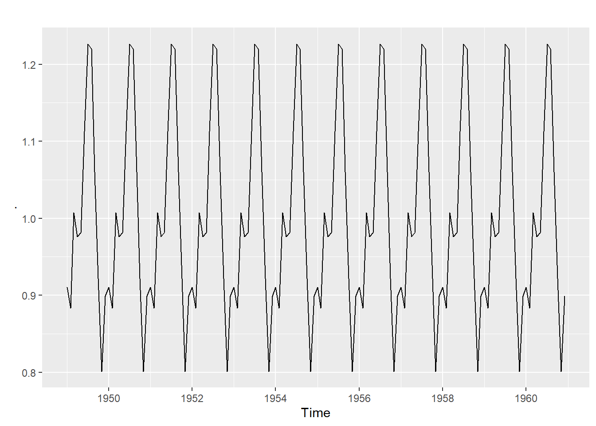

# Time Series and Forecasting


## Data Preprocessing

### **Data time series yang digunakan untuk forecasting harus terurut, lengkap, dan tidak diperkenakan terdapat missaing value (NA). Bagaimana cara melengkapkan urutan waktu yang hilang pada data time series?**

Misal terdapat dataframe seperti berikut:

```r
Quantity <- c(3,4,5)
Order.Date <- c("2019-01-03","2019-01-07","2019-01-08") 
dat <- data.frame(Order.Date, Quantity) %>% 
       mutate(Order.Date = ymd(Order.Date)) 
dat
```

```
#>   Order.Date Quantity
#> 1 2019-01-03        3
#> 2 2019-01-07        4
#> 3 2019-01-08        5
```

Anda dapat menggunakan fungsi `pad()` dari package `padr` untuk melengkapkan urutan waktu pada di atas

```r
library(padr)
dat %>% 
  pad()
```

```
#>   Order.Date Quantity
#> 1 2019-01-03        3
#> 2 2019-01-04       NA
#> 3 2019-01-05       NA
#> 4 2019-01-06       NA
#> 5 2019-01-07        4
#> 6 2019-01-08        5
```

### **Bagaimana cara melakukan imputasi untuk mengisi nilai NA pada objek time series?**

Salah satu cara yang dapat digunakan adalah mengisi nilai NA dengan fungsi `na.fill()` dari package `zoo`. Pada fungsi tersebut terdapat parameter `fill` yang digunakan untuk mendefiniskan algoritma yang digunakan untuk mengisis nilai NA, salah satunya adalah "extend" (nilai NA pada objek time series akan diisi dengan nilai yang berada di sekitar nilai NA tersebut). Penjelasan lebih detail mengenai fungsi `na.fill() dapat dilihat pada dokumentasi berikut` [Prophet&AnomalyDetection](https://drive.google.com/file/d/1J7yIsONtK9z3fDvkxnWiEHEoWVE1zdBS/view?usp=sharing)


```r
library(zoo)
dat %>% 
  pad() %>% 
  pull(Quantity)  %>% 
  ts(frequency = 7) %>% 
  na.fill(fill = "extend") 
```

```
#> Time Series:
#> Start = c(1, 1) 
#> End = c(1, 6) 
#> Frequency = 7 
#> [1] 3.00 3.25 3.50 3.75 4.00 5.00
```

Selain menggunakan fungsi di atas, Anda juga dapat menggunakan berbagai fungsi imputasi dari package `imputeTS` untuk mengisi nilai NA pada objek time series. [Time Series Imputation with imputeTS](https://cran.rstudio.com/web/packages/imputeTS/vignettes/Cheat_Sheet_imputeTS.pdf)

## Time Series

### **Apakah yang dimaksud dengan data time series? Jelaskan!**

Data time series merupakan data yang dikumpulkan berdasarkan urutan waktu. Urutan waktu yang digunakan dapat berupa detik, menit jam, hari, minggu, bulan, dll.

### **Apakah yang dimaksud dengan seasonal effects?**

Seasonal effects merupakan penyebab observasi tertentu pada data time series mengalami pola yang berulang pada siklus tertentu.

### **Apa perbedaan time series analysis dan regression analysis?**

Perbedaan utama antara analisis regresi dengan analisis time series adalah prediktor yang digunakan, jika analisis regresi menggunakan faktor exogenous sebagai prediktor. Tidak pada analisis time series yang mengggunakan nilai target di masa lampau sebagai prediktor (lag)

- Analisis regresi: $Y = X_{1} + X_{2} + X_{3} + ... + X_{n}$

- Analisis time series: $Y_{t+1} = Y_{t} + Y_{t-1} + Y_{t-2} + ... + Y_{t-n}$

### **Bagaimana jika hasil decomposition pada bagian trend masih cenderung membentuk pola berulang (seasonal)?**

Hal tersebut berarti masih terdapat pola berulang (seasonal) yang belum terangkum, kemungkinan data time series tersebut tidak hanya memiliki 1 pola berualang (seasonal). Melainkan, memiliki lebih dari 1 pola berulang (multiple seasonal). Anda bisa mencoba membuat objek msts (multiple seasonal time series) dengan menggunakan fungsi `msts()` dari package `forecast`, kemudian lakukan kembali decomposition untuk mengonfirmasi apakah periode/frekuensi seasonal yang digunakan sudah tepat atau belum. Penjelasan lebih lengkap mengenai multiple seasonal time series dapat dilihat pada [multiple seasonal](https://algotech.netlify.com/blog/multiple-seasonal/)

### **Apakah terdapat tes/uji statistik yang dapat digunakan untuk mengetahui ada atau tidaknya pola seasonal pada data time series?**   
Anda dapat melakukan beberapa cara untuk mengetahui ada tidaknya pola seasonal pada data time series, yaitu:

- Melakukan exploratory data dengan membuat line plot
- Melakukan WO test 

Namun, menurut Rob Hyndman tes di atas hanya dapat digunakan sebagai referensi tambahan untuk memperkuat deteksi yang dilakukan dengan menggunakan line plot bukan sebagai tools confirmation. Penjelasan lebih lengkap mengenai pernyataan Rob Hyndman dapat Anda baca pada referensi berikut [Detecting seasonality](https://robjhyndman.com/hyndsight/detecting-seasonality/). 

- Menghitung seasoanality strength menggunakan fungsi `stl_features()` dari package `tsfeatures`. [Introduction to the tsfeatures package: stl_featues](https://cran.r-project.org/web/packages/tsfeatures/vignettes/tsfeatures.html#stl_features)

### **Pola seasonal biasanya berulang setiap $k$ periode/frekuensi yang sama, namun bagaimana jika pola seasonal pada data time series berulang pada periode/frekuensi yang berebda. Misal, hari raya lebaran selalu bergeser setiap tahunnya. Bagaimana menentukan periode/frekuensi seasonal pada data time series tersebut?**

Secara umum pola seasonal dimabil dari pola data time series pada saat terjadi perulangan. Jika menggunakan tanggal tahun hijriah, maka gunakan periode tahun hijriah, yaitu 354.3. Namun, ketika menggunakan preiode/frekuensi tersebut, maka diasumsikan bahwa seluruh observasi (hari) memiliki pola seasonal sesuai periode/fekuensi tahun hijriah. Padahal seharusnya tidak demikian, sehingga seringkali untuk memodelkan kondisi-kondisi tertentu yang dianggap berpengaruh terhadap hasil forcasting dapat menggunakan komponen "external regressor" atau efek "covariates". Penjelasan lebih lengkap dapat dilihat pada referensi berikut [Vector autoregressions](https://otexts.com/fpp2/VAR.html)

### **Apakah fungsi `seasonplot()` dari pacakage forecast bisa membandingkan tahun-tahun tertentu saja, misalnya membandingkan suatu data time series pada rentang waktu antara tahun 1950 sampai 1951 saja?**

Jika langsung menggunakan fungsi tersebut tidak bisa, namun Anda dapat melakukan subsetting pada data time series terlebih dahulu dengan menggunakan fungsi `window()` seperti berikut

```r
window(AirPassengers, start = 1950, end = 1951) %>% 
  seasonplot(year.labels.left = T)
```


### **Berapa minimal jumlah sampel data time series untuk melakukan forecasting?**

Minimal jumlah sampel data time series yang diperlukan untuk melakukan forecasting adalah 2 periode, hal ini karena ada atau tidaknya pola berulang (seasonal) baru dapat dilihat pada 1 periode setelahnya. Sementara, jika dilakukan cross validation (splitting data) untuk data train minimal 2 periode karena pemodelan dilakukan pada data train. Sementara, jumlah sampel pada data test minimal 1 observasi. Sehingga, 2 periode plus 1 observasi, namun pada kenyaataannya jarang sekali dilakukan forecasting hanya 1 waktu ke depan. Oleh karena itu, biasanya digenapkan menjadi 1 periode untuk data test dan 2 periode untu data train.

### **Apakah mungkin terdapat data time series multiplikatif yang nilainya semakin mengecil?**

- Aditif: $Y = Tend + Seasonal + Error$

- Multiplikatif: $Y = Trend x Seasonal x Error$

Jika yang dimaksud dengan data time series multiplikati yang nilainya semakin mengecil adalah interval efek seasonality yang semakin mengecil, fenomena tersebut mungkin saja terjadi ketika data time series mengalami trend menurun yang nilainya mempengaruhi interval variansi efek seasonality. Secara matematika hal tersebut mungkin saja terjadi, tetapi jarang sekali terdapat karakteristik data time series yang demikian jika dibandingkan dengan data time series yang memiliki karakteristik interval variansinya semakin membesar.

## Forecasting

### **Apa maksud penggunaan parameter smoothing mendekati 1 pada metode exponential smoothing?**

Nilai parameter smoothing 1 berarti memberikan bobot yang lebih besar pada observasi terbaru, sementara observasi yang lebih lama diberikan bobot yang lebih kecil

### **Apakah pada analisis time series dapat menambahkan prediktor exogenous khususnya pada metode ARIMA?**

Anda dapat menambahkan prediktor exogenous pada metode ARIMA dengan menambahkan parameter`xreg` pada fungsi `Arima()` dan `auto.arima()` dari pacakge `forecast`

```r
library(fpp2)
library(forecast)
Arima(y = uschange[,1], xreg = uschange[,2], order = c(1,1,0))
```

```
#> Series: uschange[, 1] 
#> Regression with ARIMA(1,1,0) errors 
#> 
#> Coefficients:
#>           ar1    xreg
#>       -0.5412  0.1835
#> s.e.   0.0638  0.0429
#> 
#> sigma^2 estimated as 0.3982:  log likelihood=-177.46
#> AIC=360.93   AICc=361.06   BIC=370.61
```

```r
auto.arima(y = uschange[,1], xreg = uschange[,2])
```

```
#> Series: uschange[, 1] 
#> Regression with ARIMA(1,0,2) errors 
#> 
#> Coefficients:
#>          ar1      ma1     ma2  intercept    xreg
#>       0.6922  -0.5758  0.1984     0.5990  0.2028
#> s.e.  0.1159   0.1301  0.0756     0.0884  0.0461
#> 
#> sigma^2 estimated as 0.3219:  log likelihood=-156.95
#> AIC=325.91   AICc=326.37   BIC=345.29
```

Penjelasan lebih lengkap dapat Anda baca pada referensi berikut [Regression ARIMA](https://otexts.com/fpp2/regarima.html)

### **Apakah hasil forecast dari differencing yang dilakukan secara manual dengan fungsi `diff()` akan berbeda dengan hasil forecast dari differencing yang dilakukan secara otomatis pada fungsi `Arima()` atau `auto.arima()`?**

Ya akan berbeda karena perhitungan yang digunakan saat melakukan differencing pada fungsi `Arima()` ataupun `auto.arima()` berbeda dengan perhitungan yang digunakan saat melakukan differencing secara manual dengan fungsi `diff()`. Penjelasan lebih lengkap mengenai perhitungan tersebut dapat Anda baca pada referensi berikut [Difference time series before Arima or within Arima](https://stats.stackexchange.com/questions/32634/difference-time-series-before-arima-or-within-arima)

### **Apakah terdapat semacam referensi (rule of thumb) untuk menentukan nilai alpha, beta, dan gamma pada exponential smoothing?**

Tidak ada referensi (rule of thumb) mutlak untuk menentukan nilai alpha, betas, dan gamma. Penentuannya bergantung pada sudut pandang bisnis dan permasalahan yang dianalisisi. Apabila data terbaru harus diberikan bobot lebih besar, maka Anda dapat menggunakan nilai alpha, beta, dan gamma mendekati satu. Sebaliknya, apabila data terbaru dan data yang lebih lama akan diberikan bobot yang nilainya tidak jauh berbeda, maka Anda dapat menggunakan nilai alpha, beta dan gamma mendekati nol. Ada baikanya sebagai user dapat mencoba beberapa nilai alpha, beta, dan gamma (melakukan hyperparameter tuning) dengan grid search (mencoba berbagai kombinasi alpha, beta dan gamma). Penjelasan lebih lengkap dapat Anda baca pada referensi berikut [Tuning Time Series Forecasting Models](https://rdrr.io/cran/TSstudio/man/ts_grid.html)

### **Apakah mungkin nilai MAPE hasil forecasting data test untuk model double exponential smoothing (Holt) lebih kecil dibandingkan triple exponential smoothing (Holt Winters)?**

Memungkinkan karena penggunaan metode simple exonential smoothing, double exponential smoothing (Holt), ataupun triple exponential smoothing (Holt Winters) bergantung pada ada tidaknya komponen trend dan seasonal pada data time series. Nilai MAPE hasil forecasting data test untuk model double exponential smoothing (Holt) mungkin lebih kecil dibandingkan nilai MAPE hasil forecasting data test untuk model triple exponential smoothing (Holt Winters) ketika data time series hanya mempunyai komponen error dan trend saja. Dimana memang model double exponential smoothng (Holt) lebih cocok digunakan pada kondisi tersebut.

## Evaluation and Assumption

### **Apa perbedaan MAE, RMSE, dan MAPE?**

- MAE(Mean Absolute Error) cocok digunakan ketika data historis memuat nilai outlier karena nilai MAE tidak sensitif terhadap outlier.

- RMSE (Root Mean Square Error) kurang cocok digunakan ketika data historis memuat nilai outlier karena nilai RMSE sangat sensitif terhadap outlier. Namun, lebih jelas dalam menentukan nilai error (relatif kecil atau besar) karena nilai RMSE akan semakin kecil jika error yang dihasilkan kecil dan sebaliknya.

- MAPE (Mean Absolute Percentage Error), MAPE menunjukan rata-rata error absolut hasil forecasting dalam bentuk presentase terhadap data aktual. MAPE dapat digunakan pada data historis yang tidak memuat nilai 0.

## Mathematics Formula

Selain mengamati pola trend atau seasonal pada data time series, perlu diperhatikan pula apakah data time series yang dianalisis merupakan model additive atau multiplicative.


- Additive: 

$$Data = Trend + Seasonality + Error$$

- Multiplicative: 

$$Data = Trend * Seasonality * Error$$

**Decomposition** merupakan metode yang cukup sederhana dan sering digunakan untuk memahami lebih lanjut pola/struktur data time series. Decomposition adalah proses membagi data time series menjadi 3 komponen utama, yaitu:

- `trend`: pola kenaikan/penurunan
- `seasonality`: pola berulang
- `error`: pola yang tidak tertangkap oleh trend dan seasonal

> Hasil decomposition digunakan untuk mengecek apakah frequency yang ditentukan saat membuat ojek time series sudah tepat atau belum. Perhatikan pola trend, jika masih belum smooth (membentuk pola selain pola naik/turun) maka frequency yang ditentukan belum tepat. Hal ini terjadi karena masih terdapat pola seasonal yang belum tertangkap. 

**1. Menghitung secara manual decompose additive model**

Import Data 

```r
births <- read.csv("data/07-TS/nybirth.csv")
```

Membuat time series object

```r
births_ts <- ts(data = births$births, start = c(1946, 1), frequency = 12)
```

Gunakan function `decompose()`

```r
births_dc <- decompose(x = births_ts, type = "additive")
```

Objek time series di atas merupakan objek time series dengan model additive, dimana $Data = Trend + Seasonality + Error$

**TREND**

Trend diperoleh dari hasil pemulusan/smoothing `center moving average`. Smoothing dilakukan untuk memperoleh pola objek time series yang cenderung naik/turun (trend).

Mengambil nilai trend dari hasil decompose:

```r
births_dc$trend %>% autoplot()
```


Lakukan smoothing pada data actual untuk memperoleh pola trend dengan metode moving average:

```r
births_trend <- ma(births_ts, order = 12, centre = T)

births_trend %>% autoplot()
```


**SEASONALITY**

Mengambil nilai seasonal dari hasil decompose:

```r
births_dc$seasonal %>% autoplot()
```


Berikut ini merupakan step by step untuk memperoleh nilai seasonal secara manual:

1. Nilai seasonal + nilai error diperoleh dari pengurangan data actual dengan data trend

```r
sea.err_births <- births_ts - births_trend
```

2. Mencari nilai rata-rata untuk setiap frekuensi

```r
mean.mon_births <- sea.err_births %>% 
  matrix(ncol = 12, byrow = T) %>% 
  colMeans(na.rm = T)
```

3. Mencari nilai rata-rata global data time series

```r
mean.glo_births <- mean(mean.mon_births)
```

4. Mencari selisih dari rata-rata untuk setiap frekuensi dengan rata-rata global

```r
mean.mon_births - mean.glo_births
```

```
#>  [1] -0.6771947 -2.0829607  0.8625232 -0.8016787  0.2516514 -0.1532556
#>  [7]  1.4560457  1.1645938  0.6916162  0.7752444 -1.1097652 -0.3768197
```

5. Setelah diperoleh nilai seasonal dapat diimplementasikan untuk setiap frekuensi

```r
births_seasonal <- ts(rep(mean.mon_births - mean.glo_births, 14), start = start(births_ts), frequency = 12)

births_seasonal %>% autoplot()
```


**ERROR**

Error = Data - Trend - Seasonality

Mengambil nilai error dari hasil decompose:

```r
births_dc$random %>% autoplot()
```


Nilai error diperoleh dari pengurangan data actual dengan data trend dan seasonal:

```r
births_error <- births_ts - births_trend - births_seasonal

births_error %>% autoplot()
```


**2. Menghitung secara manual decompose multiplicative model**

Menggunakan data `AirPassengers` yang merupakan data bawaan R

```r
head(AirPassengers)
```

```
#>      Jan Feb Mar Apr May Jun
#> 1949 112 118 132 129 121 135
```

```r
class(AirPassengers)
```

```
#> [1] "ts"
```

Decompose time series object using `decompose()` function

```r
air_dc <- decompose(x = AirPassengers, type = "multiplicative")
```

Cara manual decompose pada multiplicative model

Objek time series di atas merupakan objek time series dengan model multiplicative, dimana $Data = Trend * Seasonality * Error$

**TREND**

Mengambil nilai trend dari hasil decompose:

```r
air_dc$trend %>% autoplot()
```



Lakukan smoothing pada data actual untuk memperoleh pola trend dengan metode moving average:

```r
air_trend <- ma(AirPassengers, order = 12, centre = T)

air_trend %>% autoplot()
```


**Seasonality**

Seasonality * Error = Data / Trend

Mengambil nilai seasonal dari hasil decompose:

```r
air_dc$seasonal %>% autoplot()
```


```r
(AirPassengers/air_trend) %>% autoplot()
```


Berikut ini merupakan step by step untuk memperoleh nilai seasonal secara manual:

1. Nilai seasonal + nilai error diperoleh dari pembagian data actual dengan data trend

```r
sea.err_air <- AirPassengers/air_trend
```

2. Mencari nilai rata-rata untuk setiap frekuensi

```r
mean.month_air <- sea.err_air %>% 
  matrix(ncol =  12, byrow = T) %>% 
  colMeans(na.rm = T)
```

3. Mencari nilai rata-rata global data time series

```r
mean.glob_air <- mean(mean.month_air)
```

4. Mencari nilai pembagian dari rata-rata untuk setiap frekuensi dengan rata-rata global

```r
mean.month_air/mean.glob_air
```

```
#>  [1] 0.9102304 0.8836253 1.0073663 0.9759060 0.9813780 1.1127758 1.2265555
#>  [8] 1.2199110 1.0604919 0.9217572 0.8011781 0.8988244
```

5. Setelah diperoleh nilai seasonal dapat diimplementasikan untuk setiap frekuensi

```r
air_seasonal <- ts(rep(mean.month_air/mean.glob_air, 12), start = start(AirPassengers), frequency = 12)
 
air_seasonal %>% autoplot()
```


**Error**

Error = Data / (Trend * Seasonality)

Mengambil nilai error dari hasil decompose:

```r
air_dc$random %>% autoplot()
```


Nilai error diperoleh dari pembagian data actual dengan hasil kali nilai trend dan nilai seasonal:

```r
air_error <- AirPassengers/(air_trend*air_seasonal)

air_error %>% autoplot()
```


